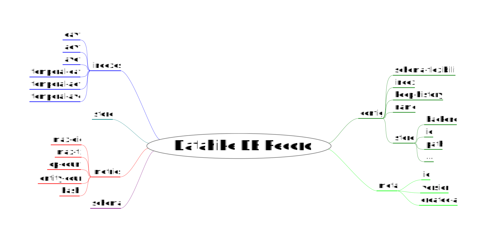

# Architecture Decision Record Template

## Context

The database record `DB` from `datahike.db` has too many fields. Extending the record with new fields is tedious and not clearly defined. 
Each change requires updating the `IConfiguration` from `datahike.connector` where the store is updated and a new `DB` record is written.

## Options

### Refactoring
Adjust the database record `DB` and combine fields into categories. Proposed fields:

- `:indexes`: all index nodes
- `config`: as it is now with cleanup
- `meta`: fixed meta data created by Datahike like `:id`, `:created-at`, `version`
- `metrics`: db metrics like `max-eid` or `op-count`
- `schema`: cleaned schema data, reverse schema can be computed
- `store`: konserve store connected Datahike is connected to

#### Pro

- cleaner DB record
- extensible

#### Contra

- possibily breaking changes if not every old field is mapped to the new way
- a lot of documentation needs to be adjusted
- refactoring needs to be done on sensitive code (`datahike.api`, `datahike.connector`, `datahike.db`)

## Status

**OPEN**

## Decision

**UNDECIDED**

## Consequences

