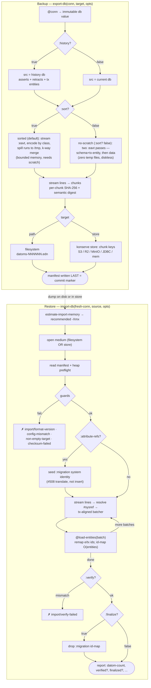

# Backup & restore

`datahike.migrate/export-db` and `import-db` write and read a portable, type-exact
dump of a database. Use them for backups, moving a database between stores, or
snapshotting before a risky change. For the format details and rationale see
[import-export-design.md](import-export-design.md).

## Flow

The diagram renders on GitHub / cljdoc; the ASCII version below it reads anywhere
(terminals, plain-text viewers).



```
╔══════════════════════════ BACKUP (export-db) ══════════════════════════╗
  export-db(conn, TARGET, opts)
        │
  @conn ─► immutable db value          (consistent snapshot)
        │
  :history? ── true ─► src = history db (asserts + retracts + tx entities)
        └── false ─► src = current db
        │
  ┌───────────────── choose ORDER (opts :sort?) ──────────────────┐
  │  :sort? true (default)          :sort? false (no-scratch)     │
  │  needs writable scratch         zero temp files               │
  │        │                              │                       │
  │  stream (datoms :eavt)          two lazy :eavt passes:        │
  │  encode by CLASS (#633)          pass1 schema + tx-entity     │
  │  spill runs → /tmp               pass2 data                   │
  │  k-way merge (bounded)           (schema-before-data)         │
  │  → t-ordered lines               → :eavt-ordered lines        │
  │        └──────────────┬───────────────┘                       │
  └───────────────────────┼───────────────────────────────────────┘
                          ▼
      stream lines → chunks, incremental per-chunk SHA-256 + digest
                          │
        ┌─────────────────┴──────────── choose TARGET ─────────────┐
        ▼                                                          ▼
   FILESYSTEM (path/dir)                       KONSERVE STORE {:store}/{:backend :s3}
    datoms-000001.edn (tmp→rename)              key [.. prefix "datoms-000001"]
    ...                                         ...  (S3 / R2 / MinIO / JDBC / mem)
        │                                             │
        ▼                                             ▼
   manifest.edn written LAST ◄─ commit marker ─► manifest key written LAST
   (stats+max-eid/max-tx, config, digest, chunk index+sha)
        │
        ▼
   BACKUP COMPLETE   (no manifest = incomplete dump, by definition)
╚═════════════════════════════════════════════════════════════════════════╝
                          │
                   dump (disk or store)
                          │
╔══════════════════════════ RESTORE (import-db) ═════════════════════════╗
                          ▼
  estimate-import-memory(SOURCE) ─► reads manifest only (no scan)
        │                           {:entities :recommended-heap :sufficient?}
        ▼   size -Xmx accordingly
  import-db(fresh-conn, SOURCE, opts)
        │
  open medium (filesystem OR konserve store)  ── same code path
        │
  read manifest ; heap preflight warning if -Xmx looks too small
        │
  GUARDS (before touching the db):
     format-version? · config-compat? · target-empty? · per-chunk SHA-256?
        │  fail ─► throw :import/{format-version,config-mismatch,
        │                         non-empty-target,checksum-failed}
        ▼ ok
  attribute-refs? ─ yes ─► seed :migration system identity  (#508 translate)
        │
        ▼
  STREAM record lines  (fs: scoped readers │ store: whole-chunk values)
        │   resolve #datahike/sysref → target system eid
        ▼
  tx-aligned batcher ─► @(load-entities conn batch)   remap e/tx ids; max-tx
        │   ▲   (tx never split; a tx spanning chunks stays whole)
        │   └── next batch      id-remap map O(entities), held until finalize
        ▼ done
  :verify?  ─► dump count == live count   else ► throw :import/verify-failed
        │
        ▼
  :finalize? ─► drop :migration id-map (frees O(entities))
        │
        ▼
  REPORT {:datom-count :tx-count :max-tx :verified? :finalized?
          :recommended-heap :errors}
╚═════════════════════════════════════════════════════════════════════════╝
```

## Export

```clojure
(require '[datahike.migrate :as m])

;; snapshot of the current value (no history)
(m/export-db conn "/backups/mydb")

;; full history — every assertion, retraction, and tx entity
(m/export-db conn "/backups/mydb" {:history? true})
```

A directory target writes the **chunked** format (`manifest.edn` +
`datoms-NNNNNN.edn`); a plain-file target writes the **flat** format. The manifest
is written last and is the commit marker — a dump directory without a
`manifest.edn` is incomplete. Export holds an immutable db value, so it is
consistent even under concurrent writes.

### Export to an external store (S3 / S3-compatible / no local disk)

For diskless deployments (e.g. Docker with no persistent volume), the dump target
can be a **konserve store** instead of a path — the same storage abstraction
datahike uses for its own data, so any backend works (S3, S3-compatible like MinIO
/ R2 / B2 via `konserve-s3`, JDBC, Redis, in-memory). The dump chunks and manifest
become keys under a prefix; the manifest key is written last as the commit marker,
and per-chunk SHA-256 guards against partial/eventually-consistent reads.

```clojure
;; an already-open konserve store (you construct it with your bucket/endpoint)
(m/export-db conn {:store my-store :prefix "backup-2026-07"} {:history? true})
(m/import-db fresh-conn {:store my-store :prefix "backup-2026-07"})

;; or a konserve store-config map (backend opened and released for you)
(m/export-db conn {:backend :s3 :bucket "my-bucket" :region "..." :id #uuid "..."
                   :prefix "backup-2026-07"} {:history? true})
```

`konserve-s3` accepts a custom `endpoint` + path-style addressing, which is how you
target S3-compatible stores (MinIO, R2, B2, Wasabi, Ceph, Spaces) — nothing here is
AWS-specific, and the S3 dependency is optional (loaded only when you use `:s3`).
The bucket/store must already exist.

### Hard read-only / zero-disk targets (`:sort? false`)

By default only the **dump** lives in the store, but the export's sort **scratch**
uses local temp files (ephemeral — fine in a normal container; point it at a RAM
mount if needed). For a container with **no writable filesystem at all**, pass
`:sort? false` to export with **no scratch**:

```clojure
(m/export-db conn {:store my-store :prefix "backup"} {:history? true :sort? false})
```

It streams schema/tx-entity datoms then data in `:eavt` order straight to the
target — no temp files, bounded memory. This relaxes the global transaction
ordering; it is safe for the common case (`load-entities` remaps ids and allocates
forward refs on sight), but does **not** preserve a *same-transaction* card-one
replacement (retract + re-assert of the same `[e a]` in one tx). If your history
has those, keep the default sorted export and give it a writable scratch path.

> **Do not run datahike GC during a long export** on a lazy-loading backend. GC
> marks reachability from branch heads only and does not pin a reader-held
> snapshot, so it can sweep index segments the in-flight export still needs.

### Memory at scale

Export orders the dump with an external merge sort and import streams it, so both
run in memory bounded by `:sort-buffer` (export run size), `:chunk-size`, and
`:batch-size` (import) — **not** by database size. A database many times larger
than the JVM heap exports and imports fine (validated: a 1.2 GB / 8.5×-heap store
exported to a 285 MB dump and re-imported, verified, under a 144 MB heap).

Two knobs matter when the heap is tight relative to the data:

- **`:store-cache-size` (connection config), for databases with large *values***.
  This is the resident index-node cache and it is bounded by node **count**, not
  bytes — so with large values (long strings, `bytes`, embedding arrays) a
  thousand cached leaf nodes can dwarf the heap. Connect the source with a small
  `:store-cache-size` (e.g. `32`) for a low-heap export; it is unrelated to the
  export/import buffers below.
- **`:sort-buffer` / `:batch-size`**, sized to your heap: peak export memory is
  roughly `:sort-buffer` records plus the merge fan-in; peak import memory is one
  `:batch-size` batch plus the O(entities) id-remap map (cleared by
  `finalize-import!`). The id-remap map is the one part that grows with entity
  count — budget for it on very large imports.

**How much RAM to give an import.** You don't have to work this out by hand — call
`estimate-import-memory` on the dump *before* importing:

```clojure
(datahike.migrate/estimate-import-memory "/backups/mydb")
;; => {:datoms 41231884 :entities 8123402
;;     :id-map-bytes 553_000_000 :batch-bytes 30_000_000
;;     :recommended-heap-bytes .. :recommended-heap "1.2 GB"
;;     :current-max-heap "512 MB" :sufficient? false}
```

It reads only the manifest (no scan) and returns the `-Xmx` to set. `import-db`
runs the same check itself and prints a heap warning to stderr when the current
`-Xmx` looks too small, and echoes `:recommended-heap` in its result. Pass the
`:batch-size` you intend to use so the estimate matches (`estimate-import-memory
source {:batch-size N}`).

## Restore

```clojure
(def report (m/import-db fresh-conn "/backups/mydb"))
;; => {:datom-count .. :tx-count .. :max-tx .. :verified? true :finalized? true :errors []}
```

Restore into a **freshly created, empty** database whose config is compatible with
the dump's `:source-config` (the manifest records it). Import:

- runs through `load-entities`, which **remaps** entity/tx ids — a restored
  database is *semantically equivalent*, never id-identical;
- **refuses a non-empty target** (`:import/non-empty-target`). Import is **not
  resumable** (the id-remap is in-memory only); if an import is interrupted,
  delete the target and start over;
- verifies itself against the manifest by default (`:verify? true`) and clears its
  bookkeeping on success (`:finalize? true`).

Options: `:batch-size`, `:verify?`, `:finalize?`, `:on-error :abort|:collect`,
`:progress-fn`. Failures are `ex-info` with a namespaced `:error` (e.g.
`:import/config-mismatch`, `:import/checksum-failed`, `:import/bad-chunk-path`).

Old flat **CBOR** dumps (produced by pre-1.0 datahike) still import through the
legacy path automatically.

## Data protection (PII / right-to-erasure)

**A `:history? true` export resurrects retracted data.** Retraction is not erasure
in an immutable database, so every value ever asserted — including "deleted"
personal data — is written into the dump. If a dump may leave your trust boundary,
export with `:history? false`. The manifest records `:history?` so a receiving
system can tell which kind it holds. Datahike has no history-excision primitive.

## Integrity & signing

Each chunk carries a SHA-256 in the manifest; `import-db`/`verify` recompute them
before touching the database. Exports are deterministic (identical source db ⇒
byte-identical chunks), so a dump can be signed by external tooling (GPG, cosign,
KMS). The manifest's semantic digest is for order-independent content comparison,
not tamper-evidence.
