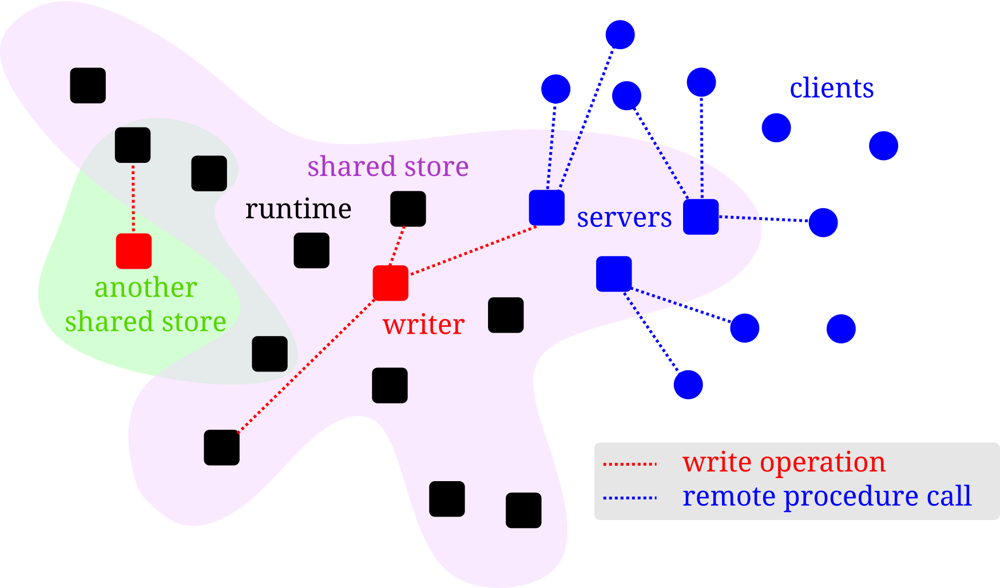

# Distributed Architecture

Datahike's architecture is built on **immutable persistent data structures** that enable efficient distribution and collaboration. The database is fundamentally designed around two complementary approaches:

1. **Distributed Index Space (DIS)**: Share persistent indices across processes—readers access data directly without database connections
2. **Remote Procedure Calls (RPC)**: Centralize computation on a server for shared caching and simplified deployment



# Distributed Index Space (DIS)

**Distributed Index Space is Datahike's key architectural advantage.** It enables massive read scalability and powers collaborative systems by treating database snapshots as immutable values that can be shared like files.

## How it works

Datahike builds on **copy-on-write persistent data structures** where changes create new structure sharing most data with previous versions. When you transact to a database:

1. New index nodes are written to the shared [storage backend](storage-backends.md) (S3, JDBC, file, etc.)
2. A new root pointer is published atomically
3. Readers pick up the new snapshot on next access—no active connections needed

This is similar to [Datomic](https://datomic.com), but **Datahike connections are lightweight and require no communication by default**. If you only need to read from a database (e.g., a dataset provided by a third party), you just need read access to the storage—no server setup required.

## Scaling and collaboration

The DIS model provides fundamental advantages for distributed systems:

- **Massive read scaling**: Add readers without coordination—they access persistent indices directly
- **Zero connection overhead**: No connection pooling, no network round-trips for reads
- **Snapshot isolation**: Each reader sees a consistent point-in-time view
- **Efficient sharding**: Create one database per logical unit (e.g., per customer, per project)—readers can join across databases locally
- **Offline-first capable**: Readers can cache indices locally and sync differentially when online

This architecture enables collaborative systems where multiple processes share access to evolving datasets without centralized coordination. The same design principles that enable DIS (immutability, structural sharing) also support more advanced distribution patterns including CRDT-based merge strategies (see [replikativ](https://github.com/replikativ/replikativ)) and peer-to-peer synchronization (demonstrated with [konserve-sync](https://github.com/replikativ/konserve-sync)).

These capabilities are valuable even in centralized production environments: differential sync reduces bandwidth, immutable snapshots simplify caching and recovery, and the architecture naturally handles network partitions.

## Single writer model

Datahike uses a **single-writer, multiple-reader** model—the same architectural choice as Datomic, Datalevin, and XTDB. While multiple readers can access indices concurrently via DIS, write operations are serialized through a single writer process to ensure strong consistency and linearizable transactions.

Concretely: a connection owns its branch head and serializes commits through it. With `:writer-ownership :exclusive` all of a database's writers live in one JVM and coordinate in memory. With `:writer-ownership :shared` (the default) several processes may commit to the same branch: each re-reads the head before a batch and, on a backend with conditional writes, publishes it with a fenced write so a concurrent commit is retried rather than lost — set `:require-fencing true` to refuse rather than silently write unfenced on a backend without them. `:exclusive` does not *make* a process the only writer; it is the process's assertion that it already is, and two exclusive writers on one branch overwrite each other. Writer-side maintenance such as [garbage collection](./gc.md#where-to-run-gc) still assumes it can see what is in flight — under shared ownership that requires the sweep floor described there. Readers are unconstrained: any number, in any number of processes. A writer endpoint (below) remains the way to funnel writes through one process.

To provide distributed write access, you configure a writer endpoint (HTTP server or Kabel WebSocket). The writer:
- Serializes all transactions for strong consistency guarantees
- Publishes new index snapshots to the shared storage backend
- Allows unlimited readers to access the updated indices via DIS

**All readers continue to access data locally** from the distributed storage (shared filesystem, JDBC, S3, etc.) without connecting to the writer—they only contact it to submit transactions. This model is supported by all Datahike clients: JVM, Node.js, browser, CLI, Babashka pod, and libdatahike.

The client setup is simple, you just add a `:writer` entry in the configuration
for your database, e.g.

```clojure
{:store  {:backend :file
          :id #uuid "a1b2c3d4-e5f6-7890-abcd-ef1234567890"
          :path "/shared/filesystem/store"}
 :keep-history?      true
 :schema-flexibility :read
 :writer             {:backend :datahike-server
                      :url     "http://localhost:4444"
                      :token   "securerandompassword"}}
```

You can now use the normal `datahike.api` as usual and all operations changing a
database, e.g. `create-database`, `delete-database` and `transact` are sent to
the server while all other calls are executed locally.

The server side is either the standalone `datahike.http.server`, or the same
routes mounted inside your own application — see
[Embedding the HTTP API](http-routes.md).

### AWS lambda

An example setup to run Datahike distributed in AWS lambda without a server can
be found [here](https://github.com/viesti/clj-lambda-datahike). It configures a
singleton lambda for write operations while reader lambdas can be run multiple
times and scale out. This setup can be upgraded later to use dedicated servers
through EC2 instances.

### Streaming writer (Kabel)

**Beta feature - please try it out and provide feedback.**

The Kabel writer provides **real-time reactive updates** via WebSockets, complementing the HTTP server's REST API. Where HTTP server is ideal for conventional REST integrations (including non-Clojure clients), Kabel enables live synchronization where clients receive database updates as they happen, without polling.

The stack consists of:

- [kabel](https://github.com/replikativ/kabel) - WebSocket transport with middleware support
- [boring](https://github.com/replikativ/boring) - the CBOR codec on the wire
- [kabel.remote](https://github.com/replikativ/kabel/blob/main/doc/remote-invocation.md) - Remote function invocation over the connection
- [konserve-sync](https://github.com/replikativ/konserve-sync) - Differential store synchronization (only transmits changed data)

This setup is particularly useful for browser clients where storage backends cannot be shared directly, and for applications requiring reactive UIs that update automatically when data changes on the server (see [JavaScript API](javascript-api.md)).

#### Server setup

The server owns the database and handles all write operations. It uses a file
backend and broadcasts updates to connected clients via konserve-sync.

```clojure
(ns my-app.server
  (:require [datahike.api :as d]
            [datahike.kabel.handlers :as handlers]
            [datahike.kabel.cbor-handlers :refer [datahike-cbor-middleware]]
            [kabel.peer :as peer]
            [kabel.http-kit :refer [create-http-kit-handler!]]
            [konserve-sync.core :as sync]
            [kabel.remote :as remote]
            [superv.async :refer [S go-try <?]]
            [clojure.core.async :refer [<!!]]))

(def server-id #uuid "aaaaaaaa-0000-0000-0000-000000000001")
(def server-url "ws://localhost:47296")

;; Store config factory - maps client store UUID to server-side file store
;; Browsers use TieredStore (memory + IndexedDB), but the server uses file backend
;; The store-id parameter is the UUID from the client's :store :id field
(defn store-config-fn [store-id _client-config]
  {:backend :file
   :path (str "/var/data/datahike/" store-id)
   :id store-id})

(defn start-server! []
  (let [;; Create kabel server peer with middleware stack:
        ;; - sync/server-middleware: handles konserve-sync replication
        ;; - remote/middleware: carries remote function invocations
        ;; - datahike-cbor-middleware: serializes Datahike types as CBOR
        server (peer/server-peer
                S
                (create-http-kit-handler! S server-url server-id)
                server-id
                (comp (sync/server-middleware) remote/middleware)
                datahike-cbor-middleware)]

    ;; Start server and enable remote function invocation
    (<!! (peer/start server))
    (remote/serve server)

    ;; Register global Datahike handlers for create-database, delete-database, transact
    ;; The :store-config-fn translates client config to server-side store config
    (handlers/register-global-handlers! server {:store-config-fn store-config-fn})

    server))
```

#### Browser client setup

Browser clients use a TieredStore combining fast in-memory access with
persistent IndexedDB storage. The KabelWriter sends transactions to the server,
and konserve-sync replicates updates back to the client's store.

**Store IDs**: Store IDs should be UUIDs for distributed coordination. Use a
fixed UUID when multiple clients need to share the same database, or generate a
unique UUID with `(random-uuid)` for ephemeral/test databases.

**Branches**: Kabel routes writes by the exact `[store-id branch]` pair and
refuses a write when that branch is not registered on the server. Register a
live server connection for every branch that clients may write with
`register-store-for-remote-access!`. A single client peer currently has one
active konserve-sync subscription per store ID, so release/unsubscribe its
current connection before switching that peer to another branch. Use separate
client peers when two branches must stay connected simultaneously.

```clojure
(ns my-app.client
  (:require [cljs.core.async :refer [<! timeout alts!] :refer-macros [go]]
            [datahike.api :as d]
            [datahike.kabel.cbor-handlers :refer [datahike-cbor-middleware]]
            [kabel.remote :as remote]
            [kabel.peer :as peer]
            [konserve-sync.core :as sync]
            [superv.async :refer [S] :refer-macros [go-try <?]]))

(def server-url "ws://localhost:47296")
(def server-id #uuid "aaaaaaaa-0000-0000-0000-000000000001")
(def client-id #uuid "bbbbbbbb-0000-0000-0000-000000000002")

(defonce client-peer (atom nil))

(defn init-peer! []
  ;; Create client peer with middleware stack (innermost runs first):
  ;; - remote/middleware: carries remote function invocations and their results
  ;; - sync/client-middleware: handles konserve-sync replication
  (let [peer-atom (peer/client-peer
                   S
                   client-id
                   (comp remote/middleware (sync/client-middleware))
                   datahike-cbor-middleware)]
    ;; Start invocation loop for handling remote calls
    (remote/serve peer-atom)
    (reset! client-peer peer-atom)))

(defn example []
  ;; go-try/<?  from superv.async propagate errors through async channels
  ;; Use go/<! if you prefer manual error handling
  (go-try S
    ;; Connect and wait until remote invocations work
    (<? S (remote/connect S @client-peer server-url))

    (let [store-id (random-uuid)
          db-name (str "db-" store-id)
          ;; TieredStore: memory frontend for fast reads, IndexedDB for persistence
          ;; The server uses file backend - store-config-fn handles this translation
          ;; Note: All :id values must match for konserve validation
          config {:store {:backend :tiered
                          :frontend-config {:backend :memory :id store-id}
                          :backend-config {:backend :indexeddb :name db-name :id store-id}
                          :id store-id}
                  :writer {:backend :kabel
                           :peer-id server-id
                           :local-peer @client-peer}
                  :schema-flexibility :write
                  :keep-history? false}]

      ;; Create database on server (a remote invocation)
      (<? S (d/create-database config))

      ;; Connect locally - syncs initial state from server via konserve-sync
      ;; TieredStore caches data from IndexedDB into memory before subscribing
      ;; so the sync handshake only requests keys newer than cached timestamps
      (let [conn (<? S (d/connect config {:sync? false}))]

        ;; Transact schema - sent to server, then synced back to local store
        (<? S (d/transact! conn [{:db/ident :name
                                  :db/valueType :db.type/string
                                  :db/cardinality :db.cardinality/one}]))

        ;; Transact data
        (<? S (d/transact! conn [{:name "Alice"} {:name "Bob"}]))

        ;; Query locally - no network round-trip needed
        (let [db (d/db conn)
              results (d/q '[:find ?name :where [?e :name ?name]] db)]
          (println "Found:" results))  ;; => #{["Alice"] ["Bob"]}

        ;; Clean up
        (d/release conn)
        (<? S (d/delete-database config))))))
```

# Cross-database references

The Distributed Index Space makes many-database deployments natural: databases
are the unit of replication (the store `:id` names the same logical database on
every peer) and of selective sharing. References ACROSS databases must be
value-level — entity ids are internal to a single index. `datahike.reference`
provides the systematic form: `(db-id, selector, temporal)` with a `dh://` URI
serialization, *living* references that track a head and *record* references
pinned via `as-of` (durable on `:keep-history?` stores), plus a reified-link
schema so cross-database links stay queryable in datalog.

See **[Cross-database references](./cross-db-references.md)** for the full
grammar, resolution semantics, and the RDF correspondence.

# Remote Procedure Calls (RPC)

In addition to DIS, Datahike supports **remote procedure calls** where all operations (reads and writes) are executed on a server. This approach is complementary to DIS:

**Use RPC when:**
- You want simplified deployment (thin clients, all logic on server)
- Shared server-side caching benefits multiple clients
- Clients are resource-constrained (mobile, embedded)
- You need conventional REST integration with non-Clojure clients

**Use DIS when:**
- Read scalability is critical (unlimited readers without server load)
- You want offline-capable or low-latency reads
- Clients need to run custom queries with local functions/closures
- Network bandwidth or availability is a concern

The remote API has the same call signatures as `datahike.api` and is located in `datahike.api.client`. All functionality except `listen!` and `with` is supported. To use it, add `:remote-peer` to your config:

```clojure
{:store  {:backend :memory :id "distributed-datahike"}
 :keep-history?      true
 :schema-flexibility :read
 :remote-peer        {:backend :datahike-server
                      :url     "http://localhost:4444"
                      :token   "securerandompassword"}}
```

The API will return lightweight remote pointers that follow the same semantics
as `datahike.api`, but do not support any of Datahike's local functionality,
i.e. you can only use them with this API.

# Hybrid Architecture

You can combine DIS and RPC in the same deployment. For example:
- A set of application servers access a shared database via DIS (direct index access)
- These servers expose RPC/REST APIs to external clients
- Internal servers benefit from DIS scalability and local query execution
- External clients get a simple REST interface without needing Datahike dependencies

This pattern is common in production systems where internal services need high-performance data access while external integrations require conventional APIs.

# HTTP Server Setup

The HTTP server provides a **REST/RPC interface** for conventional integrations with any language or tool that speaks HTTP. Use this when you need request/response semantics rather than reactive updates (for reactive updates, see Kabel above).

The batteries-included executable is attached to each GitHub release as
`datahike-http-server-VERSION-standalone.jar`. It includes the portable
Konserve backends (memory, file, tiered, S3, JDBC, DynamoDB, and Redis), the
PostgreSQL driver, and the beta pg-datahike listener. Run it with:

```bash
java -jar datahike-http-server-VERSION-standalone.jar --config path/to/config.edn
```

The thin `org.replikativ/datahike-http-server` artifact is also published to
Clojars for JVM applications that want to embed the server or exclude/replace
backends through ordinary dependency configuration. To build both artifacts
locally, clone this repository and run `bb http-server-uber`; the results are
written to `target-http-server/`. `bb http-server-smoke` runs the packaged
executable against its public shell, authenticated catalog, backend inventory,
and Prometheus endpoint. The executable uses a small Java launcher and loads
its Clojure sources on the target JVM. This keeps it portable across ordinary
OpenJDK and GraalVM builds instead of freezing build-JVM probes into AOT
bytecode.

The old positional `path/to/config.edn` form remains supported. Run with
`--help` for all deployment overrides. Configuration precedence is explicit
CLI flags, then `DATAHIKE_*` environment variables, then the EDN file. The
supported environment variables are `DATAHIKE_PORT`, `DATAHIKE_HOST`,
`DATAHIKE_TOKEN`, `DATAHIKE_DEV_MODE`, `DATAHIKE_LEVEL`,
`DATAHIKE_LOG_FORMAT`, `DATAHIKE_SHUTDOWN_TIMEOUT_MS`, and
`DATAHIKE_SYSTEM_DB_PATH`. Optional nREPL overrides are
`DATAHIKE_NREPL_PORT`, `DATAHIKE_NREPL_BIND`, and `DATAHIKE_NREPL_SOCKET`.
Log format is `text` by default and accepts `json`.
`DATAHIKE_TOKEN_FILE` reads the token from a Docker or Kubernetes secret mount
without putting it in the process environment. CLI uses the corresponding
`--port`, `--host`, `--token`, `--dev-mode`, `--level`, `--log-format`,
`--shutdown-timeout-ms`, `--system-db-path`, and `--token-file` options.
The nREPL flags are `--nrepl-port`, `--nrepl-bind`, and `--nrepl-socket`.

The edn configuration file looks like:

```clojure
{:port     4444
 :host     "127.0.0.1"
 :level    :debug
 :log-format :json
 :shutdown-timeout-ms 30000
 :dev-mode true
 :token    "securerandompassword"}
```

Port sets the `port` to run the HTTP server under, `level` sets the log-level,
and `log-format` selects human-readable `:text` or newline-delimited `:json`.
`dev-mode` deactivates authentication during development and if `token` is
provided then you need to send this token as the HTTP header "token" to
authenticate.

The standalone server refuses to bind a wildcard or non-loopback address
without effective authentication. Configure a nonblank `:token` or a custom
`:validator`, or use an explicit loopback host such as `:host "127.0.0.1"` for
unauthenticated local development. `:dev-mode true` bypasses authentication and
therefore never permits a public bind, even if a token is also present.

### Browser replicas over Kabel

The standalone server can expose an additional WebSocket listener for the
optional `datahike/kabel` npm entry. The application or identity provider
issues JWTs; Datahike validates them and does not manage user accounts.

```clojure
{:host "127.0.0.1"
 :port 4444
 :token "replace-with-an-http-token"
 :kabel
 {:host "127.0.0.1"
  :port 47296
  :peer-id #uuid "aaaaaaaa-0000-0000-0000-000000000001"
  :jwt {:alg :HS256
        :secret "replace-with-a-separate-jwt-secret"
        :required-claims {:iss "my-app" :aud "datahike"}}
  :store {:backend :file :path "/var/lib/datahike/browser-databases"}}}
```

The `:peer-id` is the value used by the browser's `writer.peer-id`; its stable
default is the UUID shown above. `:store` is server-owned and supports `:memory`
or `:file` in this first version. A client chooses a database UUID but cannot
choose a server filesystem path or backend credentials. Each file database is
stored below `:store :path` in a directory named for that UUID.

Every remote call and store subscription requires a successfully validated JWT
with a `sub` claim. Browser peers cannot publish Konserve nodes directly;
transactions go through Datahike's Kabel writer and the resulting store changes
replicate back. Authorization is the HTTP server's: with a `:system-db`, the
same eacl relationships decide, and a remote call to `datahike.kabel/dispatch`
is a `:transact` on its store, `create-database` a `:create`,
`delete-database` a `:delete`, and a store subscription a `:read`. Without a
permissions database every authenticated JWT may do everything, as over HTTP.

RS256 can use `:public-key`; deployments with multiple issuers can supply the
same trusted `:issuers` registry accepted by Kabel authentication. Terminate TLS
in front of the listener and use `wss://` outside a loopback development setup.

The current client does not automatically reconnect after a transport loss.
Recreate the peer and connection when the application decides to reconnect.
Restoring a connection across a page reload and coordinating one replica among
multiple tabs or Web Workers are not yet part of the supported lifecycle.

### Kabel transport metrics

Kabel can publish bounded transport metrics into the same
`replikativ.metrics` registry used by Datahike. Put logical-message metrics
inside Datahike's CBOR codec and wire-byte metrics outside it:

```clojure
(:require [kabel.metrics :as kabel-metrics])

(peer/server-peer
 S handler server-id
 (comp application-middleware kabel-metrics/messages)
 (comp datahike-cbor-middleware kabel-metrics/wire))
```

The counters cover message direction and type, application bytes, connection
lifecycle, and pub/sub subscription lifecycle. Labels deliberately omit peer
ids, URLs, and topics. When the peer shares a process with Datahike's HTTP
routes, the counters appear automatically at `GET /prometheus`; another host
can read the registry snapshot or choose its own exposition format.

### Developer nREPL

nREPL is bundled but disabled by default. It evaluates arbitrary code in the
server JVM and does not inherit HTTP authentication. Enable either a TCP
loopback endpoint:

```clojure
{:nrepl {:port 7888 :bind "127.0.0.1"}}
```

or, on JDK 17 and newer, an absolute Unix-domain socket:

```clojure
{:nrepl {:socket "/run/datahike-nrepl/nrepl.sock"}}
```

TCP binds are always restricted to addresses that resolve only to loopback;
configuring an HTTP token does not relax this guard. The Unix socket's parent
directory and filesystem permissions are deployment-owned. `:port` and
`:socket` are mutually exclusive. A requested nREPL that cannot start aborts
server startup, and its endpoint is stopped and its socket removed during the
normal server shutdown lifecycle.

For remote development, forward rather than expose nREPL. OpenSSH can map a
local TCP port directly to the server's Unix socket:

```bash
ssh -N -L 7888:/run/datahike-nrepl/nrepl.sock datahike-host
```

The authenticated `GET /admin/status` response reports whether nREPL is
enabled and its resolved transport endpoint. Inside an nREPL session,
`datahike.http.repl/config`, `catalog`, `runtime`, and `loaded-connections`
provide read-only conveniences for inspecting the owning server instance.

### Docker and Podman

Each GitHub release publishes the same standalone JAR as a non-root,
multi-platform image for `linux/amd64` and `linux/arm64`:

```bash
docker pull ghcr.io/replikativ/datahike-server:latest
docker volume create datahike-data
docker run --name datahike --detach \
  --publish 4444:4444 \
  --stop-timeout 40 \
  --mount type=volume,source=datahike-data,target=/var/lib/datahike \
  --env DATAHIKE_TOKEN='replace-with-a-long-random-token' \
  ghcr.io/replikativ/datahike-server:latest
```

Podman accepts the same image and equivalent arguments. For reproducible
deployments, replace `latest` with the full Datahike version tag, for example
`0.8.1856`. Stable minor tags such as `0.8` are also published. The container
listens on port 4444, stores its system catalog under `/var/lib/datahike`, and
runs as UID/GID `10001:10001`. A bind-mounted data directory must be writable
by that identity. Database file paths should also live below a persistent
mount; persisting the catalog does not implicitly persist arbitrary database
paths from client configuration.

The public container bind still requires effective authentication, so startup
fails unless a token, token file, or custom configuration provides it. Mount a
complete EDN file and append `--config /path/config.edn` to the image command
when environment shorthands are insufficient. `JAVA_TOOL_OPTIONS` remains
available for JVM sizing. The inline token above is concise for a first local
run but remains visible in container metadata; production deployments should
mount a secret readable by UID 10001 and set `DATAHIKE_TOKEN_FILE` to its
in-container path.

To expose the beta PostgreSQL listener, mount a complete server configuration
and a PKCS#12 server keystore, then publish port 5432 as well:

```clojure
{:host "0.0.0.0"
 :port 4444
 :token "replace-with-a-long-random-token"
 :system-db {:store {:backend :file :path "/var/lib/datahike/system"}}
 :pg-listener
 {:host "0.0.0.0"
  :port 5432
  :users {"app" "replace-with-a-separate-postgresql-password"}
  :tls {:keystore "/run/secrets/datahike-pg.p12"
        :keystore-password "replace-with-the-keystore-password"}}}
```

```bash
docker run --name datahike --detach \
  --publish 4444:4444 --publish 5432:5432 \
  --mount type=volume,source=datahike-data,target=/var/lib/datahike \
  --mount type=bind,source="$PWD/server.edn",target=/run/secrets/server.edn,readonly \
  --mount type=bind,source="$PWD/datahike-pg.p12",target=/run/secrets/datahike-pg.p12,readonly \
  ghcr.io/replikativ/datahike-server:latest \
  --config /run/secrets/server.edn
```

Keep the configuration readable only by the deployment identity because its
`:users` map and keystore password are secrets. PostgreSQL authentication is
separate from the HTTP token and currently grants node-wide access to all
catalog databases exposed by the listener. Clients should use
`sslmode=verify-full` with the issuing CA certificate.

The image has a built-in health check against `/health/live`. Its Java process is
PID 1 and receives SIGTERM directly. Docker's default ten-second stop timeout
is shorter than Datahike's 30-second graceful drain, hence the explicit
`--stop-timeout 40` above; use `stop_grace_period: 40s` in Compose or an
equivalent Kubernetes termination grace period.

TCP nREPL deliberately binds only inside the container's loopback namespace,
so publishing that TCP port does not expose it. For remote development, enable
the Unix socket, mount `/run/datahike-nrepl` into a host directory owned by
UID/GID 10001, and forward that socket over SSH.

To build and smoke-test the image locally after cloning the repository, run:

```bash
bb http-server-container-smoke
```

Docker is used when available, with Podman as a fallback. Set
`DATAHIKE_CONTAINER_ENGINE=podman` (or `docker`) to choose explicitly.

On SIGTERM or normal JVM shutdown, the standalone launcher first stops
accepting requests, waits up to `:shutdown-timeout-ms` (30 seconds by default)
for active requests and transactions, and then releases its database
connections, permissions database, and metrics lease. Set the timeout to zero
only when an immediate stop is preferable to draining work. Container stop
grace periods must be longer than this value so the JVM is not killed while it
is still draining.

The server exports a swagger interface on the port and can serialize requests in
`transit-json`, `edn` and `JSON` with
[jsonista](https://github.com/metosin/jsonista) tagged literals. The server
exposes all referentially transparent calls (that don't change given their
arguments) as GET requests and all requests that depend on input information as
POST requests. All arguments in both cases are sent as a list *in the request
body*.

### Extended configuration

CORS headers can be set, e.g. with adding
```clojure
 :access-control-allow-origin [#"http://localhost" #"http://localhost:8080"]
```

The server also experimentally supports HTTP caching for GET requests, e.g. by adding
```clojure
 :cache {:get {:max-age 3600}}
```

This should be beneficially in case your HTTP client or proxy supports efficient
caching and you often run the same queries many times on different queries (e.g.
to retrieve a daily context in an app against a database only changes with low
frequency.)

# JSON Support (HTTP Server)

The HTTP server supports JSON with embedded [tagged literals](https://github.com/metosin/jsonista#tagged-json) for language-agnostic integration. This allows non-Clojure clients (JavaScript, Python, etc.) to interact with Datahike using familiar JSON syntax.

When sending HTTP requests to the datahike-server, you can use JSON argument arrays in each method body. Include the "token" header if authentication is enabled.

`POST` to "/create-database"
```javascript
["{:schema-flexibility :read}"]
```
Note that here you can pass the configuration as an `edn` string, which is more concise. If you want to speak JSON directly you would pass
```
[{"schema-flexibility": ["!kw", "read"]}]
```

"!kw" annotates a tagged literal here and encodes that "read" is an `edn`
keyword.

The resulting configuration will look like (with random DB name):
```javascript
cfg = {
  "keep-history?": true,
  "search-cache-size": 10000,
  "index": [
    "!kw",
    "datahike.index/persistent-set"
  ],
  "store": {
    "id": "wiggly-field-vole",
    "backend": [
      "!kw",
      "memory"
    ]
  },
  "store-cache-size": 1000,
  "attribute-refs?": false,
  "writer": {
    "backend": [
      "!kw",
      "self"
    ]
  },
  "crypto-hash?": false,
  "remote-peer": null,
  "schema-flexibility": [
    "!kw",
    "read"
  ],
  "branch": [
    "!kw",
    "db"
  ]
}
```

You can now use this cfg to connect to this database:

`POST` to "/connect"
```javascript
[cfg]
```

The result will look like:

```javascript
conn = ["!datahike/Connection",[[["!kw","memory"],"wiggly-field-vole"],["!kw","db"]]]
```

Finally let's add some data to the database:

`POST` to "/transact"
```javascript
[conn, [{"name": "Peter", "age": 42}]]
```

The result is a comprehensive transaction record (feel free to ignore the details):

```javascript
[
  "!datahike/TxReport",
  {
    "db-before": [
      "!datahike/DB",
      {
        "store-id": [
          [
            [
              "!kw",
              "memory"
            ],
            "wiggly-field-vole"
          ],
          [
            "!kw",
            "db"
          ]
        ],
        "commit-id": [
          "!uuid",
          "2c8f71f9-a3c6-4189-ba0c-e183cc29c672"
        ],
        "max-eid": 1,
        "max-tx": 536870913
      }
    ],
    "db-after": [
      "!datahike/DB",
      {
        "store-id": [
          [
            [
              "!kw",
              "memory"
            ],
            "wiggly-field-vole"
          ],
          [
            "!kw",
            "db"
          ]
        ],
        "commit-id": [
          "!uuid",
          "6ebf8979-cdf0-41f4-b615-30ff81830b0c"
        ],
        "max-eid": 2,
        "max-tx": 536870914
      }
    ],
    "tx-data": [
      [
        "!datahike/Datom",
        [
          536870914,
          [
            "!kw",
            "db/txInstant"
          ],
          [
            "!date",
            "1695952443102"
          ],
          536870914,
          true
        ]
      ],
      [
        "!datahike/Datom",
        [
          2,
          [
            "!kw",
            "age"
          ],
          42,
          536870914,
          true
        ]
      ],
      [
        "!datahike/Datom",
        [
          2,
          [
            "!kw",
            "name"
          ],
          "Peter",
          536870914,
          true
        ]
      ]
    ],
    "tempids": {
      "db/current-tx": 536870914
    },
    "tx-meta": {
      "db/txInstant": [
        "!date",
        "1695952443102"
      ],
      "db/commitId": [
        "!uuid",
        "6ebf8979-cdf0-41f4-b615-30ff81830b0c"
      ]
    }
  }
]
```

Note that you can extract the snapshots of the database `db-before` and `db-after` the commit as well as the facts added to the database as `tx-data`.

To retrieve the current database for your connection use

`POST` to "/db"
```javascript
[conn]
```

The result looks like:

```javascript
db = [
  "!datahike/DB",
  {
    "store-id": [
      [
        [
          "!kw",
          "mem"
        ],
        "127.0.1.1",
        "wiggly-field-vole"
      ],
      [
        "!kw",
        "db"
      ]
    ],
    "commit-id": [
      "!uuid",
      "6ebf8979-cdf0-41f4-b615-30ff81830b0c"
    ],
    "max-eid": 2,
    "max-tx": 536870914
  }
]
```

You can query this database with the query endpoint. We recommend again using a string to denote the query DSL instead of direct JSON encoding unless you want to manipulate the queries in JSON programmatically.

`GET` from "/q"
```javascript
["[:find ?n ?a :where [?e :name ?n] [?e :age ?a]]", db]
```

The result set is

```javascript
["!set",[["Peter",42]]]
```

You can also pass strings for pull expressions and to pass configurations to `delete-database` and `database-exists`.
