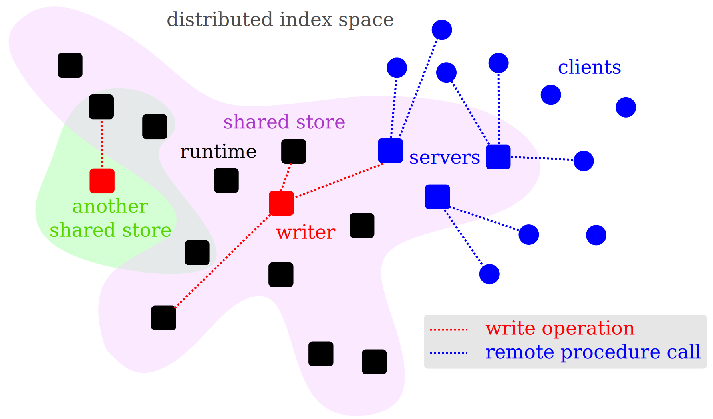

# Distribution

Datahike supports two types of distributed access, *distribution of data* or
*distribution of computation*. Distribution of data means that each Datahike
`runtime` can access `store`s in the `distributed index space` (DIS), while
distribution of computation means that `client`s send requests to be evaluated to
be processed by a `server` on a remote runtime.



# Distributed index space (DIS)

Datahike has a similar memory model to [Datomic](https://datomic.com), which is
built on distributed persistent indices. But while Datomic requires active
connections to its transactor, Datahike works with lightweight connections that
do not require communication by default.

In case where you do not need to write to a database, only *read* from it, e.g.
a database that a 3rd party provides you access to, it is sufficient to have
read access rights to the store, no setup of a server or additional steps are
needed to join against the indices of this external database!

Note: This allows you to *massively shard* databases. A good design pattern is
to create a separate database for a set of facts that you need to consistently
update together, e.g. one database per business client.

## Single writer

If you want to provide distributed write access to databases you need to setup a
server as described in the section at the end. Datahike then centralizes all
write operations and state changes to the database on this single machine, while
all read operations still can happen locally on as many machines as have access
to the distributed konserve store (e.g. shared filesystem, JDBC, S3, etc.). The
benefit of the single writer is that it provides strong linearization guarantees
for transactions, i.e. strong consistency. This memory model is also supported
by the CLI, babashka and libdatahike clients.

The client setup is simple, you just add a `:writer` entry in the configuration
for your database, e.g.

```clojure
{:store  {:backend :file :scope "your.domain.com" :path "/shared/filesystem/store"}
 :keep-history?      true
 :schema-flexibility :read
 :writer             {:backend :datahike-server
                      :url     "http://localhost:4444"
                      :token   "securerandompassword"}}
```

You can now use the normal `datahike.api` as usual and all operations changing a
database, e.g. `create-database`, `delete-database` and `transact` are sent to
the server while all other calls are executed locally.

### AWS lambda

An example setup to run Datahike distributed in AWS lambda without a server can
be found [here](https://github.com/viesti/clj-lambda-datahike). It configures a
singleton lambda for write operations while reader lambdas can be run multiple
times and scale out. This setup can be upgraded later to use dedicated servers
through EC2 instances.

### Streaming writer (Kabel)

**This feature is in beta. Please try it out and provide feedback.**

While the HTTP-based `datahike-server` uses request/response for each
transaction, the Kabel writer uses WebSockets for streaming updates. This
enables real-time synchronization where clients receive database updates as they
happen, without polling. The stack consists of:

- [kabel](https://github.com/replikativ/kabel) - WebSocket transport with
  middleware support
- [distributed-scope](https://github.com/replikativ/distributed-scope) - Remote
  function invocation
- [konserve-sync](https://github.com/replikativ/konserve-sync) - Store
  replication with differential sync

This setup is particularly useful for browser clients where the underlying store
cannot be shared directly (see [ClojureScript Support](cljs-support.md)).

#### Server setup

The server owns the database and handles all write operations. It uses a file
backend and broadcasts updates to connected clients via konserve-sync.

```clojure
(ns my-app.server
  (:require [datahike.api :as d]
            [datahike.kabel.handlers :as handlers]
            [datahike.kabel.fressian-handlers :as fh]
            [kabel.peer :as peer]
            [kabel.http-kit :refer [create-http-kit-handler!]]
            [konserve-sync.core :as sync]
            [is.simm.distributed-scope :refer [remote-middleware invoke-on-peer]]
            [superv.async :refer [S go-try <?]]
            [clojure.core.async :refer [<!!]]))

(def server-id #uuid "aaaaaaaa-0000-0000-0000-000000000001")
(def server-url "ws://localhost:47296")

;; Fressian middleware with Datahike type handlers for serialization
(defn datahike-fressian-middleware [peer-config]
  (kabel.middleware.fressian/fressian
   (atom fh/read-handlers)
   (atom fh/write-handlers)
   peer-config))

;; Store config factory - maps client scope-id to server-side file store
;; Browsers use TieredStore (memory + IndexedDB), but the server uses file backend
(defn store-config-fn [scope-id _client-config]
  {:backend :file
   :path (str "/var/data/datahike/" scope-id)
   :scope scope-id})

(defn start-server! []
  (let [;; Create kabel server peer with middleware stack:
        ;; - sync/server-middleware: handles konserve-sync replication
        ;; - remote-middleware: handles distributed-scope RPC
        ;; - datahike-fressian-middleware: serializes Datahike types
        server (peer/server-peer
                S
                (create-http-kit-handler! S server-url server-id)
                server-id
                (comp (sync/server-middleware) remote-middleware)
                datahike-fressian-middleware)]

    ;; Start server and enable remote function invocation
    (<!! (peer/start server))
    (invoke-on-peer server)

    ;; Register global Datahike handlers for create-database, delete-database, transact
    ;; The :store-config-fn translates client config to server-side store config
    (handlers/register-global-handlers! server {:store-config-fn store-config-fn})

    server))
```

#### Browser client setup

Browser clients use a TieredStore combining fast in-memory access with
persistent IndexedDB storage. The KabelWriter sends transactions to the server,
and konserve-sync replicates updates back to the client's store.

```clojure
(ns my-app.client
  (:require [cljs.core.async :refer [<! timeout alts!] :refer-macros [go]]
            [datahike.api :as d]
            [datahike.kabel.fressian-handlers :refer [datahike-fressian-middleware]]
            [is.simm.distributed-scope :as ds]
            [kabel.peer :as peer]
            [konserve-sync.core :as sync]
            [superv.async :refer [S] :refer-macros [go-try <?]]))

(def server-url "ws://localhost:47296")
(def server-id #uuid "aaaaaaaa-0000-0000-0000-000000000001")
(def client-id #uuid "bbbbbbbb-0000-0000-0000-000000000002")

(defonce client-peer (atom nil))

(defn init-peer! []
  ;; Create client peer with middleware stack (innermost runs first):
  ;; - ds/remote-middleware: handles distributed-scope RPC responses
  ;; - sync/client-middleware: handles konserve-sync replication
  (let [peer-atom (peer/client-peer
                   S
                   client-id
                   (comp ds/remote-middleware (sync/client-middleware))
                   datahike-fressian-middleware)]
    ;; Start invocation loop for handling remote calls
    (ds/invoke-on-peer peer-atom)
    (reset! client-peer peer-atom)))

(defn example []
  ;; go-try/<?  from superv.async propagate errors through async channels
  ;; Use go/<! if you prefer manual error handling
  (go-try S
    ;; Connect to server via distributed-scope
    (<? S (ds/connect-distributed-scope S @client-peer server-url))

    (let [scope-id (random-uuid)
          ;; TieredStore: memory frontend for fast reads, IndexedDB for persistence
          ;; The server uses file backend - store-config-fn handles this translation
          config {:store {:backend :tiered
                          :frontend-store {:backend :mem :id (str "mem-" scope-id)}
                          :backend-store {:backend :indexeddb :name (str "db-" scope-id)}
                          :scope (str scope-id)}
                  :writer {:backend :kabel
                           :peer-id server-id
                           :scope-id scope-id
                           :local-peer @client-peer}
                  :schema-flexibility :write
                  :keep-history? false}]

      ;; Create database on server (transmitted via distributed-scope RPC)
      (<? S (d/create-database config))

      ;; Connect locally - syncs initial state from server via konserve-sync
      ;; TieredStore caches data from IndexedDB into memory before subscribing
      ;; so the sync handshake only requests keys newer than cached timestamps
      (let [conn (<? S (d/connect config {:sync? false}))]

        ;; Transact schema - sent to server, then synced back to local store
        (<? S (d/transact! conn [{:db/ident :name
                                  :db/valueType :db.type/string
                                  :db/cardinality :db.cardinality/one}]))

        ;; Transact data
        (<? S (d/transact! conn [{:name "Alice"} {:name "Bob"}]))

        ;; Query locally - no network round-trip needed
        (let [db (d/db conn)
              results (d/q '[:find ?name :where [?e :name ?name]] db)]
          (println "Found:" results))  ;; => #{["Alice"] ["Bob"]}

        ;; Clean up
        (d/release conn)
        (<? S (d/delete-database config))))))
```

# Distribution of compute

Datahike supports sending all requests to a server. This has the benefit that
the server will do all the computation and its caches will be shared between
different clients. The disadvantage is that you cannot easily share information
in process, e.g. call your own functions or closures in queries without
deploying them to the server first.

## Remote procedure calls (RPCs)

The remote API has the same call signatures as `datahike.api` and is located in
`datahike.api.client`. Except for listening and `with` all functionality is
supported. Given a server is setup (see below), you can interact with it by
adding `:remote-peer` to the config you would otherwise with `datahike.api`:

```clojure
{:store  {:backend :mem :id "distributed-datahike"}
 :keep-history?      true
 :schema-flexibility :read
 :remote-peer        {:backend :datahike-server
                      :url     "http://localhost:4444"
                      :token   "securerandompassword"}}
```

The API will return lightweight remote pointers that follow the same semantics
as `datahike.api`, but do not support any of Datahike's local functionality,
i.e. you can only use them with this API.

# Combined distribution

Note that you can combine both data accesses, i.e. run a set of servers sharing
a single writer among themselves, while they all serve a large set of outside
clients through RPCs.

# Setup datahike.http.server

To build it locally you only need to clone the repository and run `bb
http-server-uber` to create the jar. The server can then be run with `java -jar
datahike-http-server-VERSION.jar path/to/config.edn`.

The edn configuration file looks like:

```clojure
{:port     4444
 :level    :debug
 :dev-mode true
 :token    "securerandompassword"}
```

Port sets the `port` to run the HTTP server under, `level` sets the log-level.
`dev-mode` deactivates authentication during development and if `token` is
provided then you need to send this token as the HTTP header "token" to
authenticate.

The server exports a swagger interface on the port and can serialize requests in
`transit-json`, `edn` and `JSON` with
[jsonista](https://github.com/metosin/jsonista) tagged literals. The server
exposes all referentially transparent calls (that don't change given their
arguments) as GET requests and all requests that depend on input information as
POST requests. All arguments in both cases are sent as a list *in the request
body*.

### Extended configuration

CORS headers can be set, e.g. with adding
```clojure
 :access-control-allow-origin [#"http://localhost" #"http://localhost:8080"]
```

The server also experimentally supports HTTP caching for GET requests, e.g. by adding
```clojure
 :cache {:get {:max-age 3600}}
```

This should be beneficially in case your HTTP client or proxy supports efficient
caching and you often run the same queries many times on different queries (e.g.
to retrieve a daily context in an app against a database only changes with low
frequency.)

# JSON support

The remote API supports JSON with embedded [tagged
literals](https://github.com/metosin/jsonista#tagged-json). There are two
extensions for convenience provided (please provide feedback or explore better
options if you have ideas!).

Provided you are sending HTTP requests to a datahike-server you can put the
following JSON argument arrays into each method body. You have to provide
the "token" in the header if you use authentication.

`POST` to "/create-database"
```javascript
["{:schema-flexibility :read}"]
```
Note that here you can pass the configuration as an `edn` string, which is more concise. If you want to speak JSON directly you would pass
```
[{"schema-flexibility": ["!kw", "read"]}]
```

"!kw" annotates a tagged literal here and encodes that "read" is an `edn`
keyword.

The resulting configuration will look like (with random DB name):
```javascript
cfg = {
  "keep-history?": true,
  "search-cache-size": 10000,
  "index": [
    "!kw",
    "datahike.index/persistent-set"
  ],
  "store": {
    "id": "wiggly-field-vole",
    "scope": "127.0.1.1",
    "backend": [
      "!kw",
      "mem"
    ]
  },
  "store-cache-size": 1000,
  "attribute-refs?": false,
  "writer": {
    "backend": [
      "!kw",
      "self"
    ]
  },
  "crypto-hash?": false,
  "remote-peer": null,
  "schema-flexibility": [
    "!kw",
    "read"
  ],
  "branch": [
    "!kw",
    "db"
  ]
}
```

You can now use this cfg to connect to this database:

`POST` to "/connect"
```javascript
[cfg]
```

The result will look like:

```javascript
conn = ["!datahike/Connection",[[["!kw","mem"],"127.0.1.1","wiggly-field-vole"],["!kw","db"]]]
```

Finally let's add some data to the database:

`POST` to "/transact"
```javascript
[conn, [{"name": "Peter", "age": 42}]]
```

The result is a comprehensive transaction record (feel free to ignore the details):

```javascript
[
  "!datahike/TxReport",
  {
    "db-before": [
      "!datahike/DB",
      {
        "store-id": [
          [
            [
              "!kw",
              "mem"
            ],
            "127.0.1.1",
            "wiggly-field-vole"
          ],
          [
            "!kw",
            "db"
          ]
        ],
        "commit-id": [
          "!uuid",
          "2c8f71f9-a3c6-4189-ba0c-e183cc29c672"
        ],
        "max-eid": 1,
        "max-tx": 536870913
      }
    ],
    "db-after": [
      "!datahike/DB",
      {
        "store-id": [
          [
            [
              "!kw",
              "mem"
            ],
            "127.0.1.1",
            "wiggly-field-vole"
          ],
          [
            "!kw",
            "db"
          ]
        ],
        "commit-id": [
          "!uuid",
          "6ebf8979-cdf0-41f4-b615-30ff81830b0c"
        ],
        "max-eid": 2,
        "max-tx": 536870914
      }
    ],
    "tx-data": [
      [
        "!datahike/Datom",
        [
          536870914,
          [
            "!kw",
            "db/txInstant"
          ],
          [
            "!date",
            "1695952443102"
          ],
          536870914,
          true
        ]
      ],
      [
        "!datahike/Datom",
        [
          2,
          [
            "!kw",
            "age"
          ],
          42,
          536870914,
          true
        ]
      ],
      [
        "!datahike/Datom",
        [
          2,
          [
            "!kw",
            "name"
          ],
          "Peter",
          536870914,
          true
        ]
      ]
    ],
    "tempids": {
      "db/current-tx": 536870914
    },
    "tx-meta": {
      "db/txInstant": [
        "!date",
        "1695952443102"
      ],
      "db/commitId": [
        "!uuid",
        "6ebf8979-cdf0-41f4-b615-30ff81830b0c"
      ]
    }
  }
]
```

Note that you can extract the snapshots of the database `db-before` and `db-after` the commit as well as the facts added to the database as `tx-data`.

To retrieve the current database for your connection use

`POST` to "/db"
```javascript
[conn]
```

The result looks like:

```javascript
db = [
  "!datahike/DB",
  {
    "store-id": [
      [
        [
          "!kw",
          "mem"
        ],
        "127.0.1.1",
        "wiggly-field-vole"
      ],
      [
        "!kw",
        "db"
      ]
    ],
    "commit-id": [
      "!uuid",
      "6ebf8979-cdf0-41f4-b615-30ff81830b0c"
    ],
    "max-eid": 2,
    "max-tx": 536870914
  }
]
```

You can query this database with the query endpoint. We recommend again using a string to denote the query DSL instead of direct JSON encoding unless you want to manipulate the queries in JSON programmatically.

`GET` from "/q"
```javascript
["[:find ?n ?a :where [?e :name ?n] [?e :age ?a]]", db]
```

The result set is

```javascript
["!set",[["Peter",42]]]
```

You can also pass strings for pull expressions and to pass configurations to `delete-database` and `database-exists`.
