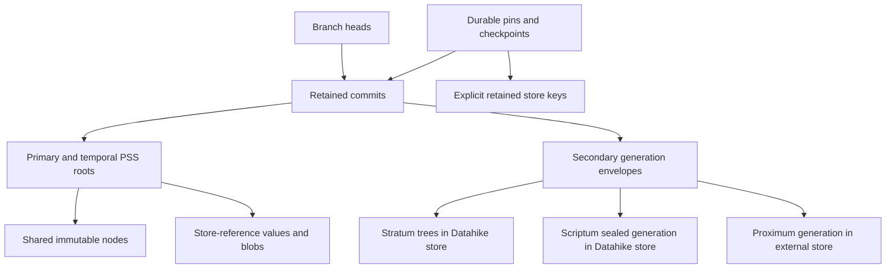

# Memory ownership and garbage collection audit

Audit date: 2026-09-30. This is a map of current behavior and a proposed work sequence, not a claim that the proposed barriers are implemented. Issue scope is all open issues and issues closed since 2026-07-02: 75 open and 18 recently closed. Issue metadata is kept in a local working inventory; the links below identify the reviewed sources. Detailed body/comment review focused on 14 issues in the work-stream table; older inventory entries have not all been reproduced or reviewed in depth. An open tracker entry does not establish that its original bug remains reproducible.

## Source versions

| Repository | Local revision | Qualification |
| --- | --- | --- |
| Datahike | `903fd1bc` | Primary implementation inspected |
| persistent-sorted-set | `02670dd` | Datahike dependency is `0.5.144`; verify any local API change against that artifact |
| Proximum | `f85c98f` | Older than the generation integration used by Datahike; also inspected the actual `0.1.38` dependency source |
| Stratum | `bcb4628` | Datahike dependency is `0.3.84` |
| Scriptum | `6c86fac` | Datahike dependency is `0.1.32` |
| Konserve | `b812eb2` | Local filestore edits exist; conclusions below concern the GC/protocol code read |
| konserve-s3 | `6252223` | Backend source inspected |
| branchbench-clj | `744828a` | README, dependencies and workload sources have local edits |
| Original BranchBench (`db-fork`) | `20d3499` | Runner/protocol edits exist; upstream is `ElaineAng/db-fork` |
| Dolt | `a8f5de1541` | Checkout located; benchmark README specifies binary version `1.81.2`, which is a separate fact |
| datahike.io | `6ec9674` | Public copy policies read; no site changes in this audit |

Local working copies and published dependencies must remain distinct in tests and claims. In particular, Proximum's older checkout catches tree traversal exceptions and returns an incomplete mark. Its `0.1.38` artifact propagates these failures and rejects missing generation roots. That is an upgrade/documentation concern for standalone users, not a newly established bug in Datahike's pinned integration.

## Four kinds of memory

| Region | Owner and lifetime | What releases it | What does not protect it |
| --- | --- | --- | --- |
| JVM/JS heap | Database values, transaction transients, PSS nodes, query results and caches | Runtime GC after references disappear; cache eviction | Heap references alone do not register durable roots |
| Durable store | PSS nodes, commits, schemas, blobs and secondary generations | Collector with complete roots and a safe deletion contract | Runtime GC, cache eviction, or branch removal alone |
| Native resources and local files | Proximum mmap views; Scriptum Lucene readers, writers, segments and workspaces | Explicit view/owner close and component cache cleanup | Durable reachability does not close an unused local handle |
| OS page cache and backend buffers | Mapped/file-backed pages and pending IO | OS reclamation and backend completion | Heap usage alone does not measure total memory |

Primary EAVT/AEVT/AVET trees, and their temporal counterparts when present, use copy-on-write PSS structure. A changed version shares unchanged durable nodes with older versions. Lazy restoration means a database value may need a store read long after it was obtained. Consequently, keeping an old DB value in heap is insufficient if a collector can remove its unloaded nodes. A durable pin is the retention mechanism.

Stratum adds column chunks and PSS trees. Its local node cache is bounded by node count, not bytes: a large column leaf costs much more than a branch node. Record heap bytes, cache entries, restored bytes and pending writes separately. Proximum's integrated generations use reference-counted mmap views; historical/divergent opens may need independent caches. Scriptum separates durable sealed generations from disposable Lucene workspaces. These resource lifetimes must be tested independently from durable collection.

Sources: [Datahike store](../src/datahike/store.cljc), [PSS integration](../src/datahike/index/persistent_set.cljc), [secondary generation contracts](secondary-indices.md#branching-and-versioning), and [Stratum cached storage](https://github.com/replikativ/stratum/blob/bcb4628/src/stratum/cached_storage.clj).

## Current durable graph and publication

The relevant roots include every branch head, retained history under the chosen policy, durable pin/checkpoint/ref records and explicit keys, plus secondary roots named by those records. Traversing only today's connected branch is insufficient. Schema records are needed to interpret store-reference values and secondary envelopes; missing required metadata must abort marking.

Writers generally write values before publishing the pointer that makes them reachable. `konserve.gc-guard` protects this interval in one process: begin the guard before writing values; publish or abandon; then close it. The collector obtains its timestamp cutoff **before** marking. Reading the guard after marking permits a writer to publish and close its guard between the two observations.

Datahike defaults self writers to shared ownership. The sweep floor defaults to 15 minutes for shared/remote writers and zero for an explicitly local exclusive writer. This is a clock/age allowance, not a distributed snapshot protocol. Retention cutoff for history and age cutoff for deleting payloads are different controls.

Durable roots use `:datahike/gc-roots` and per-root records. Leases have expiry/grace behavior and must be renewed for long operations. GC revisits new or changed root records after marking, with a bounded stabilization loop. This reduces races but does not establish atomic exclusion between the final root read and sweep. Live heads with an index in `:building` state defer collection; historical build metadata alone must not defer it forever.

Secondary publication prepares and seals an immutable generation before the Datahike head names it. Cleanup distinguishes rooted, orphaned and uncertain publication outcomes. Uncertain publication must not be treated as permission to delete. Pure `db-with` mutation is a separate capability: Stratum supports the in-memory path; external-writing adapters must not simulate purity.

Sources: [GC contract](gc.md#the-gc-safety-contract), [roots](gc.md#durable-roots), [collector](../src/datahike/gc.cljc), [root registry](../src/datahike/gc_roots.cljc), [guard](../src/datahike/gc_guard.cljc), [secondary protocols](../src/datahike/index/secondary.cljc), and [Konserve guard](https://github.com/replikativ/konserve/blob/b812eb2/src/konserve/gc_guard.cljc).

## Operational modes and collector authority

| Mode | Collection authority | Current protection | Remaining limit |
| --- | --- | --- | --- |
| Local exclusive Datahike, durable mark/sweep | Datahike over its whole owned store | Process guard, complete mark, durable roots; default age floor zero | Root promotion during sweep still needs a defined contract; readers need pins |
| Shared/remote Datahike writers | Datahike collector, coordinated with all publishers | Conditional head publication, durable roots, default age floor | Head CAS does not fence payload deletion; process guards cannot see other processes |
| Frozen/resumed collector, including Lambda | Requires durable coordination across the full pass | Age floor and late root checks are mitigations | Stale mark may omit old objects newly promoted into a live root |
| Datahike online GC | Freed-address consumer under its supported restrictions | Guards for nonzero diff buffers, multiple branches and live roots | Freed hints are not global reachability; do not relax restrictions without a proof |
| Embedded Stratum / Scriptum | Datahike in the primary store | Exact generation marking through adapter contracts | Native collectors must not independently sweep this shared keyspace |
| Embedded Proximum | External owner with a root set exported by Datahike | Exact generation IDs and stable external store identity | Root discovery does not authorize external deletion; no end-to-end collection epoch yet |
| Standalone Stratum | Stratum, with its native dataset branches | Per-store process monitor over sync/GC | Flat UUID sweep overlaps other PSS users; separate ownership is necessary; not a cross-process barrier |
| Standalone Scriptum | Its native store/filesystem collector | Native branch/snapshot rules; Konserve path has guard/mark/sweep | Filesystem Lucene retention and Konserve generation GC are different modes |
| Standalone Proximum | Proximum over its owned store | Pinned `0.1.38` accepts authoritative detached generation IDs, fails closed | Older sibling checkout has weaker failure handling; owner must supply all detached roots |

Do not equate `:sync?` IO execution with exclusive ownership or collection safety. Do not run a component's whole-store sweep merely because its own roots are complete: other owners may have roots in the same store. Scriptum cache GC, Proximum view close and Stratum cache eviction should remain available without granting durable deletion authority.

The older Stratum `gc-and-store-ownership` document describes a Scriptum sidecar/empty-mark arrangement. The current Datahike adapter marks Scriptum generations in the primary Konserve store. Update that documentation against the current adapter before using its ownership table operationally.

Sources: [secondary GC](secondary-indices.md), [online GC](../src/datahike/online_gc.cljc), [Stratum standalone collector](https://github.com/replikativ/stratum/blob/bcb4628/src/stratum/storage.clj#L244), [Scriptum Konserve collector](https://github.com/replikativ/scriptum/blob/6c86fac/src/clojure/scriptum/konserve.clj#L1707), and the Proximum `0.1.38` artifact's `proximum.gc` / `proximum.generations`.

## Safety invariants for the next design

1. Every durably publishable root has an owner, a storage identity and a retention policy. A heap reference becomes a protected reader only through a registered pin or an explicitly bounded reader contract.
2. Marking covers structural nodes **and** payload references in leaves, including column/vector chunks, Lucene manifests/segments and store-reference datoms. Failure to enumerate required edges aborts sweep.
3. All publishers participate: transactions, force-branch, pin/checkpoint registration, import, migration, backfill and external generation publication. Protecting the ordinary transaction path alone is insufficient.
4. Once a deletion candidate is authorized, a publisher cannot make it live without participating in the collection protocol. A root revision/token checked before an unconditional delete does not enforce this invariant.
5. A resumed collector cannot delete using an expired authority. Heartbeat/lease expiry must revoke actual deletion authority, not merely change a registry entry that the suspended process can ignore.
6. Immutable node identity includes store incarnation, owner/format and address semantics. Recycled addresses must not reuse remembered reachability from an older object at that address.
7. Collector metadata is itself rooted, versioned and recoverable. A failed cache/index update can require a full mark; it cannot permit a partial sweep.

Two candidate protocols need separate evaluation. A process-exclusive mode can serialize publication and the full collector under one enforceable owner, accepting stalled progress if that owner freezes. A distributed mode needs durable publication/collection coordination and an enforceable deletion primitive or an equivalent rule preventing revival of retired generations. Neither an age floor nor a renewable lease alone supplies that primitive. On a backend with unconditional batched deletion, checking a token and then sending DeleteObjects leaves a race.

The precise counterexample for [#960](https://github.com/replikativ/datahike/issues/960) is old, unmarked nodes becoming reachable after the mark. Newly written objects are normally spared by the old cutoff. A correct test must distinguish those cases. Conditional head publication addresses [#878](https://github.com/replikativ/datahike/issues/878), but not this payload race.

## Remembering marked nodes

The current primary marker makes a fresh address set for each tree walk. Commit traversal avoids some repeated commit visits, but unioning marks after traversal does not avoid repeatedly expanding shared tree nodes. Measure node expansions and actual backend reads separately: an LRU hit can avoid IO while still paying traversal/allocation costs.

### First step: deduplicate within one collection

Thread a mark context across all roots, keyed by physical storage identity and node address/interpretation. For PSS walks, an already fully expanded subtree can return false from the visitor to prune it. Return true for new nodes: the callback's return value controls traversal. Audit JVM and CLJS behavior, diff-buffer anchors and leaf payload enumeration before using this shortcut. An address-only structural walk must not cause a second adapter to skip its semantic payload edges.

This is the smallest useful optimization because no marks survive changes in the root set. Test two roots sharing a subtree: expand it once, preserve its entire closure, then remove one root and verify unchanged correctness.

### Second step: persist reusable graph information

A persistent-sorted-set is a plausible index for remembered addresses, but a sticky set of previously live nodes is not a collector: it either keeps dead nodes forever or skips descendants that the current pass still needs to preserve.

Recommended prototype: cache complete adjacency for immutable nodes, with entries conceptually keyed by `[store-incarnation owner format address]` and containing structural children plus typed payload edges. Keep a separate live-address index for each completed collection epoch. A new collection traverses the current roots through cached edges, restoring only uncached nodes. This reduces decode/backend-read costs across cycles; it still visits the reachable graph unless a complete subtree closure can also be safely reused. A PSS can hold the cache and epoch membership, allowing ordered membership checks and persistence, but its own nodes require a bootstrap root and separate collection rules.

Publish the mark-index manifest only after every reachable node has a complete entry. An incomplete/missing entry means restore and recompute; a failed restore aborts sweep. Distinguish cache entries from current liveness. Bound cache growth, including adjacency for dead nodes. Exclude or version recycled addresses. Start with the offline collector, keeping online freed streams as hints under [#951](https://github.com/replikativ/datahike/issues/951).

Full subtree closure caches can consume substantially more space through duplication. Incremental reference counts require complete edge accounting, root add/remove journaling and crash recovery. Compare these alternatives experimentally before replacing the full-mark oracle. PSS element differences alone do not capture storage reachability, especially with diff-buffer anchors.

Acceptance cases: branch/history removal; two versions sharing an anchor; pin expiry and renewal; repeated address under a new store incarnation; missing cache entry; partially committed mark index; secondary leaf payloads; unknown adapter/format; and recovery after restart. Compare resulting live/dead sets with an independent full mark.

Source: [primary marker](../src/datahike/index/persistent_set.cljc#L243) and [PSS visitor contract](https://github.com/replikativ/persistent-sorted-set/blob/02670dd/src-clojure/org/replikativ/persistent_sorted_set.clj#L614).

## Konserve and S3 sweep costs

The current Konserve sweep obtains key metadata, filters by reachability and logical last-write timestamp, and partitions candidates into batches. Multi-key-capable stores use `multi-dissoc`; others delete individual keys concurrently. It accumulates the deleted keys in a set, so memory grows with the number deleted. Async fallback starts all deletes in a batch; sync fallback uses `pmap` with the current unchunked batches.

S3 listing follows continuation tokens, accumulating object names. Native DeleteObjects batching already exists for whole-store deletion, but the normal backing-store delete path is per object. Normal sweep needs Konserve's logical metadata; S3 object timestamps are not automatically equivalent. Therefore, native batch deletion alone reduces delete requests but does not remove listing/metadata-read costs.

Proposed work, in order:

1. Instrument listing pages, metadata reads, mark reads, delete calls, retries, bytes and peak retained memory. Retain baseline correctness before changing IO.
2. Introduce a delete-only backend capability rather than claiming atomic multi-key writes solely to enable batched deletion. Route sweep through it, respecting provider limits and reporting per-key failures. Retry failed keys, not silently accept partial success.
3. Add bounded concurrency/cancellation and an optional statistics-only result so large sweeps need not retain every deleted key. Preserve the existing API return contract for callers needing it.
4. Add paginated/reducible metadata enumeration. Examine a maintained metadata/candidate index only with its write/recovery costs and authority model defined.
5. Integrate the selected collection protocol before allowing distributed/resumed deletion. Faster stale sweeps amplify the same correctness problem.

Test empty pages, continuation boundaries, duplicate candidates, partial deletion failures, retry idempotence, cancellation, missing objects and concurrent publication. Use an S3 test backend for correctness and a separately recorded live S3 run for request costs. Preserve existing local Konserve filestore changes.

Sources: [Konserve sweep](https://github.com/replikativ/konserve/blob/b812eb2/src/konserve/gc.cljc), [store protocols](https://github.com/replikativ/konserve/blob/b812eb2/src/konserve/protocols.cljc), and [S3 backend](https://github.com/replikativ/konserve-s3/blob/6252223/src/konserve_s3/core.clj).

## Issue work streams and proposed PR sequence

| Priority | Work | Relevant issues | Completion criterion |
| --- | --- | --- | --- |
| 1 | Collection/publication schedule tests and explicit supported modes | [#960](https://github.com/replikativ/datahike/issues/960), [#951](https://github.com/replikativ/datahike/issues/951), [#878](https://github.com/replikativ/datahike/issues/878); closed [#961](https://github.com/replikativ/datahike/issues/961) | Reproduce old-node promotion and frozen collector schedules; distinguish implemented containment from missing protocol |
| 1 | Import error propagation | [#971](https://github.com/replikativ/datahike/issues/971) | Verify current `superv.async` artifact and propagate JVM `Error` through import/report/cleanup; regression must not hang |
| 1 | Temporal secondary correctness | [#947](https://github.com/replikativ/datahike/issues/947), [#948](https://github.com/replikativ/datahike/issues/948) | Reproduce sparse update/no-op assertions; test persisted and transient valid-time capability; current `vt-aware?` already checks enabled capability |
| 1 | Query correctness and database identity | [#938](https://github.com/replikativ/datahike/issues/938), [#943](https://github.com/replikativ/datahike/issues/943), [#972](https://github.com/replikativ/datahike/issues/972) | Current revision reproducer, engine parity and actual affected validator/hash paths; do not repeat withdrawn duplicate-initial-datom explanation in #943 |
| 2 | Deduplicate full marks within a cycle | #951 context | Same reachability as full oracle, fewer expansions across shared roots, JVM/CLJS parity |
| 2 | Native S3 sweep batches and bounded enumeration | Backend work | Correct partial failure handling and measured requests/memory |
| 3 | Durable barrier implementation | #960 | Selected protocol, backend capability matrix and deterministic crash/freeze tests; all root publishers covered |
| 3 | Persisted adjacency/mark index | #951 context | Recovery-safe cache, epoch liveness, bounded retained metadata, measured cross-cycle savings |
| 4 | Reader basis synchronization | [#958](https://github.com/replikativ/datahike/issues/958) | Define basis observation, timeout and retention pin independently |
| 4 | Data-sensitive plan caching and deterministic fuel | [#963](https://github.com/replikativ/datahike/issues/963), [#964](https://github.com/replikativ/datahike/issues/964) | Freshness policy first; deterministic operation order/budget if promised |
| 4 | Aggregate routing across engines | [#952](https://github.com/replikativ/datahike/issues/952) | Provider-owned columns and capabilities, preserving temporal/ownership semantics |
| Separate | Dependency footprint | [#1095](https://github.com/replikativ/datahike/issues/1095), opened by Ramblurr | Dependency provenance and separate runtime/build/test scope; avoid coupling to GC redesign |

Use separate PRs for the schedule tests/mode contract, mark deduplication, backend batching, durable coordination, and persistent mark metadata. Barrier work and mark reuse solve different problems. The first PR should establish the schedules and supported modes; an implementation that cannot enforce the invariant on a backend should refuse that mode rather than imply a stronger guarantee.

Recent closed issues from mokshasoft, markaddleman and other contributors are also relevant benchmark controls: planner result correctness/recursive memory, view hashing and released-writer behavior. Their closed status is not a reason to skip regression coverage, nor a reason to reopen them without a current reproducer. #1024 is closed following the query normalization work in PR #1099.

Artifact verification for #971: the cached test dependency `superv.async 0.3.51` implements `throw-if-exception-` using JVM `instance? Exception`, so the reported distinction from `Error` remains present in that helper. This verifies the helper's behavior by source inspection; the current import end-to-end failure/cleanup schedule still needs a regression test.

## Benchmark plan and communication

The original repository is [ElaineAng/db-fork](https://github.com/ElaineAng/db-fork); our adaptation is [replikativ/branchbench-clj](https://github.com/replikativ/branchbench-clj). The [BranchBench paper](https://arxiv.org/abs/2604.17180) defines five workload families. The local Clojure harness currently implements sequential, depth-1 `failure_repro` and four evaluation queries, not all five complete workflows. Its README results section is marked as regenerating. Data directories establish that workloads were prepared; they are not a verified raw-results bundle.

Before comparison, freeze exact harness/database revisions, runtime flags, hardware, dataset/seed, schema and FK indexes, durability, backend, storage medium, cache state, warmup, worker count, branch shape/depth, retention and GC policy. Disable whole-query result caching during both warmup and timing. Validate answer equivalence, duplicate-sensitive aggregates and transactional tuple/FK loading. Record the in-process Datalog versus SQL network-interface asymmetry. Distinguish Dolt from DoltgreSQL and identify the exact baseline used.

Extend measurement in two layers. First isolate GC: vary live roots, shared-node fraction, retained history, deletion fraction, pins, diff buffers and enabled secondary engines; measure mark expansions/reads, sweep requests/time, metadata overhead, heap/RSS/mmap and post-GC cold reads. Include a full-mark oracle and process freeze schedules. Then add deep MCTS and wide/concurrent simulation workflows, followed by remaining complete workflows. Separate foreground latency and storage cost with GC disabled, scheduled and concurrent, under equal retention semantics.

A useful blog topic is **Collecting shared history without deleting live branches**. Explain the ownership graph, a frozen collector counterexample, supported modes, the difference between remembered adjacency and live marks, and backend request costs. Publish performance numbers only once commands and raw artifacts reproduce them; identify remaining distributed limitations explicitly. The first article can teach the current contract without claiming the redesign has shipped.

Suggested initial outreach to the BranchBench authors should ask for workload/retention alignment and an acceptable Datahike backend contribution, rather than lead with an unverified speed comparison. Outreach drafts are kept as local working notes. No outreach or site publication is performed by this audit.

## Validation status

This document is a source/issue audit, with dependency-artifact inspection where the sibling source diverges. It introduces no runtime changes. Existing targeted tests (`gc-test`, `gc-roots-test`, `gc-safe-defaults-test`, `online-gc-test`) passed on the current Datahike checkout: **38 tests, 136 assertions, zero failures/errors**. They exercise current protections and do not establish safety for the proposed distributed mode. The added schedule tests establish the bounded-mode counterexample; crash and coordinated-mode tests remain required for the barrier implementation.

PR1 validation on upstream `23692d77`: the four existing GC namespaces plus `gc-schedule-test` passed **42 tests / 151 assertions**. The deterministic interposition covers an explicit-key durable root and public API mode forwarding; it does not simulate an independent OS process or establish secondary/distributed barrier soundness.
