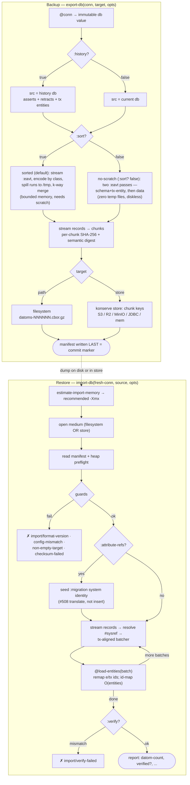

# Migration: backup, restore, and moving data

`datahike.migrate` reads and writes a database as a stream of **records** —
`[e a v t op]`, entity, attribute, value, transaction, asserted-or-retracted.
That one mechanism covers three jobs that are usually separate tools:

| | |
|---|---|
| **Backup and restore** | `export-db` / `import-db` to a portable, type-exact, verifiable dump. Snapshot before a risky change; restore after one. |
| **Moving between stores** | the same dump, written to a filesystem path *or* a konserve store — file, S3, JDBC, in-memory, IndexedDB. Change backend by exporting from one and importing to another. |
| **Moving between systems** | `import-source` / `export-to-sink` hand you the record stream itself, so the other side can be a live database rather than a file — see [Migrating from Datomic](./migrate-datomic.md). |

They are the same code path. A dump is just the record stream with a manifest
and checksums around it; a foreign system is the record stream with an adapter
around it. Anything true of one — bounded memory, `:xform`, verification,
history fidelity — is true of the others, which is why they are documented
together.

Start with **[Export](#export)** and **[Restore](#restore)** for backups,
**[Migrating a live database](#migrating-a-live-database)** to change storage
backend, and **[Beyond dumps](#beyond-dumps-import-source-and-export-to-sink)**
to read from or write to something that is not a dump at all.

## Flow

The diagram renders on GitHub / cljdoc; the ASCII version below it reads anywhere
(terminals, plain-text viewers).



```
╔══════════════════════════ BACKUP (export-db) ══════════════════════════╗
  export-db(conn, TARGET, opts)
        │
  @conn ─► immutable db value          (consistent snapshot)
        │
  :history? ── true ─► src = history db (asserts + retracts + tx entities)
        └── false ─► src = current db
        │
  ┌───────────────── choose ORDER (opts :sort?) ──────────────────┐
  │  :sort? true (default)          :sort? false (no-scratch)     │
  │  needs writable scratch         zero temp files               │
  │        │                              │                       │
  │  stream (datoms :eavt)          two lazy :eavt passes:        │
  │  encode by CLASS (#633)          pass1 schema + tx-entity     │
  │  spill runs → /tmp               pass2 data                   │
  │  k-way merge (bounded)           (schema-before-data)         │
  │  → t-ordered lines               → :eavt-ordered lines        │
  │        └──────────────┬───────────────┘                       │
  └───────────────────────┼───────────────────────────────────────┘
                          ▼
      stream records → chunks, incremental per-chunk SHA-256 + digest
                          │
        ┌─────────────────┴──────────── choose TARGET ─────────────┐
        ▼                                                          ▼
   FILESYSTEM (path/dir)                       KONSERVE STORE {:store}/{:backend :s3}
    datoms-000001.cbor.gz (tmp→rename)              key [.. prefix "datoms-000001"]
    ...                                         ...  (S3 / R2 / MinIO / JDBC / mem)
        │                                             │
        ▼                                             ▼
   manifest.edn written LAST ◄─ commit marker ─► manifest key written LAST
   (stats+max-eid/max-tx, config, digest, chunk index+sha)
        │
        ▼
   BACKUP COMPLETE   (no manifest = incomplete dump, by definition)
╚═════════════════════════════════════════════════════════════════════════╝
                          │
                   dump (disk or store)
                          │
╔══════════════════════════ RESTORE (import-db) ═════════════════════════╗
                          ▼
  estimate-import-memory(SOURCE) ─► reads manifest only (no scan)
        │                           {:entities :recommended-heap :sufficient?}
        ▼   size -Xmx accordingly
  import-db(fresh-conn, SOURCE, opts)
        │
  open medium (filesystem OR konserve store)  ── same code path
        │
  read manifest ; heap preflight warning if -Xmx looks too small
        │
  GUARDS (before touching the db):
     format-version? · config-compat? · target-empty? · per-chunk SHA-256?
        │  fail ─► throw :import/{format-version,config-mismatch,
        │                         non-empty-target,checksum-failed}
        ▼ ok
  attribute-refs? ─ yes ─► seed :migration system identity  (#508 translate)
        │
        ▼
  STREAM record lines  (fs: scoped readers │ store: whole-chunk values)
        │   resolve #datahike/sysref → target system eid
        ▼
  tx-aligned batcher ─► @(load-entities conn batch)   remap e/tx ids; max-tx
        │   ▲   (tx never split; a tx spanning chunks stays whole)
        │   └── next batch      id-remap map O(entities), held for the import
        ▼ done
  :verify?  ─► dump count == live count   else ► throw :import/verify-failed
        │
        ▼
  REPORT {:datom-count :tx-count :max-tx :verified?
          :recommended-heap :errors}
╚═════════════════════════════════════════════════════════════════════════╝
```

## Export

```clojure
(require '[datahike.migrate :as m])

;; snapshot of the current value (no history)
(m/export-db conn "/backups/mydb")

;; full history — every assertion, retraction, and tx entity
(m/export-db conn "/backups/mydb" {:history? true})
```

Export always writes a DIRECTORY: `manifest.edn` plus numbered chunks
(`datoms-NNNNNN.cbor.gz` — the suffix is the compression codec's, `.cbor` with
`{:compression :none}`). There is no single-file write path; old flat dumps are
still READ on import, but nothing produces them. The manifest is written last
and is the commit marker — a dump directory without a `manifest.edn` is
incomplete. Export holds an immutable db value, so it is
consistent even under concurrent writes.

### Export to an external store (S3 / S3-compatible / no local disk)

For diskless deployments (e.g. Docker with no persistent volume), the dump target
can be a **konserve store** instead of a path — the same storage abstraction
datahike uses for its own data, so any backend works (S3, S3-compatible like MinIO
/ R2 / B2 via `konserve-s3`, JDBC, Redis, in-memory). The dump chunks and manifest
become keys under a prefix; the manifest key is written last as the commit marker,
and per-chunk SHA-256 guards against partial/eventually-consistent reads.

```clojure
;; an already-open konserve store (you construct it with your bucket/endpoint)
(m/export-db conn {:store my-store :prefix "backup-2026-07"} {:history? true})
(m/import-db fresh-conn {:store my-store :prefix "backup-2026-07"})

;; or a konserve store-config map (backend opened and released for you)
(m/export-db conn {:backend :s3 :bucket "my-bucket" :region "..." :id #uuid "..."
                   :prefix "backup-2026-07"} {:history? true})
```

`konserve-s3` accepts a custom `endpoint` + path-style addressing, which is how you
target S3-compatible stores (MinIO, R2, B2, Wasabi, Ceph, Spaces) — nothing here is
AWS-specific, and the S3 dependency is optional (loaded only when you use `:s3`).
The bucket/store must already exist.

### Hard read-only / zero-disk targets (`:sort? false`)

By default only the **dump** lives in the store, but the export's sort **scratch**
uses local temp files (ephemeral — fine in a normal container; point it at a RAM
mount if needed). For a container with **no writable filesystem at all**, pass
`:sort? false` to export with **no scratch**:

```clojure
(m/export-db conn {:store my-store :prefix "backup"} {:history? true :sort? false})
```

It streams schema/tx-entity datoms then data in `:eavt` order straight to the
target — no temp files, bounded memory. This relaxes the global transaction
ordering; it is safe for the common case (`load-entities` remaps ids and allocates
forward refs on sight), but does **not** preserve a *same-transaction* card-one
replacement (retract + re-assert of the same `[e a]` in one tx). If your history
has those, keep the default sorted export and give it a writable scratch path.

> **Do not run datahike GC during a long export** on a lazy-loading backend. GC
> marks reachability from branch heads only and does not pin a reader-held
> snapshot, so it can sweep index segments the in-flight export still needs.

### Memory at scale

Export orders the dump with an external merge sort and import streams it, so both
run in memory bounded by `:sort-buffer` (export run size), `:chunk-size`, and
`:batch-size` (import) — **not** by database size. A database many times larger
than the JVM heap exports and imports fine (validated: a 1.2 GB / 8.5×-heap store
exported to a 285 MB dump and re-imported, verified, under a 144 MB heap).

Two knobs matter when the heap is tight relative to the data:

- **`:store-cache-size` (connection config), for databases with large *values***.
  This is the resident index-node cache and it is bounded by node **count**, not
  bytes — so with large values (long strings, `bytes`, embedding arrays) a
  thousand cached leaf nodes can dwarf the heap. Connect the source with a small
  `:store-cache-size` (e.g. `32`) for a low-heap export; it is unrelated to the
  export/import buffers below.
- **`:sort-buffer` / `:batch-size`**, sized to your heap: peak export memory is
  roughly `:sort-buffer` records plus the merge fan-in; peak import memory is one
  `:batch-size` batch plus the O(entities) id-remap map, which the import holds
  for its whole duration. That map is the one part that grows with entity count —
  budget for it on very large imports, or use `:build-indexes?`, whose default
  `:eids :preserve` needs no map at all.

**How much RAM to give an import.** You don't have to work this out by hand — call
`estimate-import-memory` on the dump *before* importing:

```clojure
(datahike.migrate/estimate-import-memory "/backups/mydb")
;; => {:datoms 41231884 :entities 8123402
;;     :id-map-bytes 553_000_000 :batch-bytes 30_000_000
;;     :recommended-heap-bytes .. :recommended-heap "1.2 GB"
;;     :current-max-heap "512 MB" :sufficient? false}
```

It reads only the manifest (no scan) and returns the `-Xmx` to set. `import-db`
runs the same check itself and prints a heap warning to stderr when the current
`-Xmx` looks too small, and echoes `:recommended-heap` in its result. Pass the
`:batch-size` you intend to use so the estimate matches (`estimate-import-memory
source {:batch-size N}`).

## Restore

```clojure
(def report (m/import-db fresh-conn "/backups/mydb"))
;; => {:datom-count .. :tx-count .. :max-tx .. :verified? true :errors []}
```

Restore into a **freshly created, empty** database whose config is compatible with
the dump's `:source-config` (the manifest records it). Import:

- runs through `load-entities`, which **remaps** entity/tx ids — a restored
  database is *semantically equivalent*, never id-identical. (`:build-indexes? true`
  below is the exception: from a `:history? true` dump it reproduces the
  source's ids and `:max-tx` exactly, because it allocates the mapping up front
  and never transacts.)
- **refuses a non-empty target** (`:import/non-empty-target`). Import is **not
  resumable** (the id-remap is in-memory only); if an import is interrupted,
  delete the target and start over;
- **refuses a dump that holds fewer records than its source did, with nothing to
  explain the gap** (`:import/incomplete-dump`, carrying `:missing`) — see
  [Detecting an incomplete dump](#detecting-an-incomplete-dump) below;
- verifies itself against the manifest by default (`:verify? true`).

Options:

| option | default | what it does |
|---|---|---|
| `:verify?` | `true` | check the imported datom count against the manifest's |
| `:on-error` | `:abort` | `:abort` or `:collect` — never silently skips |
| `:batch-size` | 100k | datoms per `load-entities` call (default path; tx-aligned, never split) |
| `:xform` | — | a transducer over `[e a v t op]` records |
| `:check-refs?` | `false` | report ref values naming an entity that holds no datoms |
| `:merge?` | `false` | add this dump to a non-empty target (append-only) |
| `:eids` | `:allocate` | how source ids bind to target ids (`:preserve` by default under `:build-indexes?`) |
| `:build-indexes?` | `false` | build a fresh database from sorted input — see below |
| `:checksums` | `:require` | `:skip` imports **without** verifying chunk hashes, and warns |
| `:sort-buffer` | 200k | records held in memory per sort run (`:build-indexes?`) |
| `:spool-codec` | `:gzip` | compression for the index-build scratch spool; `:none` to disable |
| `:spool-chunk-size` | 100k | records per spool file |
| `:dangling-sample` | 10 | how many dangling refs `:check-refs?` includes in its report |
| `:allow-partial?` | `false` | import a dump with an unexplained shortfall anyway |
| `:progress-fn` | — | called with `{:phase … :datoms …}` |

Failures are `ex-info` with a namespaced `:error` (e.g.
`:import/config-mismatch`, `:import/checksum-failed`, `:import/bad-chunk-path`,
`:import/incomplete-dump`, `:import/apply-failed`, `:import/verify-unavailable`,
`:import/build-indexes-refused`).

### What the report says about verification

`:verified?` is `true`, `false`, or `nil` — and `nil` alone cannot tell you
whether verification was switched off, had nothing to compare against, or failed
under `:on-error :collect`. The report therefore also carries `:verification`,
which says which:

| `:status` | `:verified?` | meaning |
|---|---|---|
| `:ok` | `true` | the restored count matched what the source declared |
| `:failed` | `false` | it did not; `:missing` says by how much |
| `:skipped` | `nil` | you passed `:verify? false`; nothing is claimed |
| `:unavailable` | `nil` | the source declares no record count, so there was nothing to check against |

`:failed` and `:unavailable` **throw** unless `:on-error :collect`, whose whole
contract is to report rather than abort. Under `:collect`, `:missing` and the
length of `:errors` should agree — each missing datom accounted for by a
collected error.

### What `:on-error :collect` will and will not survive

`:collect` exists to survive a bad **record** and name it, so it applies only to
failures a record can be responsible for — datahike's own `:transact/…`,
`:entity-id/…`, `:lookup-ref/…`, `:schema/…` and `:import/…` rejections. Each
appears in `:errors` under the error key datahike raised, together with the
datom it blames.

Anything else — a store outage, a shut-down writer — aborts with
`:import/apply-failed`, carrying the original exception as its cause. It is not
filed against your data, and the import does not continue retrying records one
at a time against something that cannot accept any of them.

### Detecting an incomplete dump

Every other integrity signal a dump carries — `:datom-count`, the semantic
digest, the per-chunk SHA-256 — is computed from what was **written**. A dump
that lost records therefore agrees with itself perfectly, so checking it against
itself proves nothing: a 205-datom database exported short to 120 produced a
manifest saying 120, a matching digest, and `verify` returning `:ok? true`.

The manifest's `:stats` therefore also carries an **independent** witness:

| key | meaning |
|---|---|
| `:datom-count` | records written to the dump |
| `:source-datom-count` | records the source database held, counted from the database — `nil` if the export was run with `{:count-source? false}` |
| `:transformed?` | true when an `:xform` was applied, i.e. a smaller dump is expected |

`import-db` refuses a dump where `:source-datom-count` exceeds `:datom-count`
and `:transformed?` is false, since that is what a truncated export looks like.
An `:xform` dump is smaller *and says so*, and imports normally. Pass
`{:allow-partial? true}` to restore a short dump deliberately — it is the right
call when the alternative is no restore at all, and it is your decision rather
than a silent one.

Counting the source costs one index scan at export time; `{:count-source? false}`
skips it and records `:source-datom-count nil`, which reads as *unknown* and
disables the check for that dump.

Old flat **CBOR** dumps (produced by pre-1.0 datahike) still import through the
legacy path automatically.

### Building a fresh database from a dump (`:build-indexes? true`) — beta

```clojure
(m/import-db fresh-conn "/backups/mydb" {:build-indexes? true})
;; => {:build-indexes? true :datom-count .. :max-tx-drift 0 :verified? true ..}
```

Instead of replaying the dump datom by datom, this **builds the index trees
directly from sorted input** — the case a B-tree's insertion cost exists to
avoid when the data is already known in full. The dump is read twice (once to
compute the complete id mapping, once to normalise it to a single file), sorted
three times, and all six trees are constructed from sorted streams and published
in **one commit**.

The result is a database equal field-for-field to the one the default path
produces — every index, `:hash`, `:schema`, `:rschema`, `:max-eid`, the ident
maps — with two differences, both by design:

* **`:max-tx` is the dump's exactly**, not one higher. The streaming import ends
  via a transaction, which bumps it; this one never transacts. With
  `:history? true` that makes an index-build restore *id-identical* to its source,
  which the streaming path cannot manage.
* **`:op-count` differs**, which is inert for the persistent-set index (every
  index operation takes it as an unused argument) and matters only to the
  deprecated hitchhiker-tree, which is refused anyway.

It is **opt-in and refused rather than downgraded**. `:build-indexes? true` that cannot
be honoured throws with the reason, because an import that silently took the
slow path would look like a mysterious performance result rather than a
configuration mistake. The reasons: `:merge?` or a non-empty target (building
trees from sorted input cannot apply upsert semantics against existing data —
index-building and `:merge?` are complements), a non-persistent-set index,
`:attribute-refs? true`, a dump whose schema declares a secondary index, and
a caller-supplied `:eids`.

It runs on **ClojureScript/Node** too, under `:sync? false` — the only mode
there is. Both of the refusals that used to name a runtime are gone: neither
described something the builder could not reproduce. The dump read and the tree
build are awaited; the three sorts in between read a local scratch spool with
synchronous primitives on both runtimes, which is what keeps them ordinary lazy
seqs.

**No speedup figure is quoted here.** The earlier one was withdrawn as unsound
and has not been re-measured end to end.

An **aborted** index build is destructive under `:crypto-hash? false`: flushed
index nodes may reuse freelist addresses, so a build that fails midway has
already overwritten them. Restore into a database you are willing to recreate —
which, for a restore, is the normal case.

## Migrating a live database

Export/import moves a database that is standing still. A production migration is
the other case: the source keeps taking writes, so the dump is stale before it
finishes, and the delta grows for as long as the migration runs.

The recipe below reduces downtime to the final catch-up window. Everything it
uses already exists; nothing here is a separate feature.

> **Catching up without a listener.** The recipe below holds a `d/listen!` open
> on the source for the whole migration, which means the source machine buffers
> the backlog. If that is not acceptable —  a large delta, or a production box
> you would rather not add memory pressure to — `datahike.experimental.diff`
> can compute the same catch-up window *after the fact* from two database
> values, at a cost proportional to the delta rather than the database:
>
> ```clojure
> (require '[datahike.experimental.diff :as xd])
> (xd/tx-range db-before db-after)  ;=> [{:t 536870915 :data [...]} ...]
> ```
>
> It needs `:keep-history? true`, and it needs the older version's index nodes
> to still be in the store — `d/gc-storage` reclaims exactly those, so do not
> collect past the point you intend to catch up from. *Experimental*; see the
> namespace docstring.

```clojure
(require '[datahike.api :as d] '[datahike.migrate :as m])

;; 1. LISTENER FIRST — before the snapshot, deliberately
(def backlog (atom []))
(d/listen conn ::migration (fn [report] (swap! backlog conj report)))

;; 2. then the snapshot: a plain db VALUE, not the connection
(def snapshot @conn)
(def watermark (:max-tx snapshot))

;; 3. export the snapshot while the source keeps taking writes
(m/export-db snapshot "/backups/cutover" {:history? true})

;; 4. restore, PRESERVING entity ids
(m/import-db new-conn "/backups/cutover" {:build-indexes? true})

;; 5. catch up: everything newer than the watermark
(defn catch-up! []
  (let [[pending _] (reset-vals! backlog [])]
    (doseq [r pending
            :when (> (long (:max-tx (:db-after r))) (long watermark))
            :let [ops (->> (:tx-data r)
                           (remove (fn [d] (= (:e d) (:tx d))))   ; skip tx entities
                           (mapv (fn [d] [(if (:added d) :db/add :db/retract)
                                          (:e d) (:a d) (:v d)])))]
            :when (seq ops)]
      (d/transact new-conn ops))))

(catch-up!)          ; repeat while the backlog is still large
;; ... stop writes ...
(catch-up!)          ; final, short window
(d/unlisten conn ::migration)
```

### Why the listener goes first

**Registration does not need to be atomic with the snapshot**, which is what
makes this simple. Register first and a transaction landing in the gap appears
in *both* the snapshot and the backlog; `:max-tx` is an exact watermark, so the
replay filter drops it. Register *after* the snapshot and such a transaction
appears in neither — it is lost.

So the ordering is load-bearing in one direction only, and the cost of getting
it right is remembering to filter.

### Why `:build-indexes?`

It preserves entity ids. The backlog's datoms carry the *source's* eids, so they
are only replayable if the restored database uses the same ones — and the
default import path allocates fresh ids and does not hand back the mapping (it
is O(entities), so the report carries only its size). `:build-indexes?` defaults
to `:eids :preserve` for an empty target, which is exactly what this needs.

### What is preserved, and what is not

Measured on a source taking writes throughout — five transactions racing the
snapshot, eleven more during the migration:

| | |
|---|---|
| `[e a v]` including **entity ids** | identical |
| history, excluding tx entities | identical |
| `as-of` on the target | works |
| transaction granularity | preserved **if** you replay one target transaction per source transaction |
| `:db/txInstant` of replayed transactions | **differs** — they are genuinely new transactions with their own timestamps |

Batching the replay collapses transaction structure: batching 200 datoms at a
time turned 18 source transactions into 3 in the target. Content and ids were
still identical — but `history` and `as-of` on the delta then see coarser
transactions than the source had. Replay per source transaction if that matters,
and pass explicit `:tx-meta` if wall-clock provenance does.

### Two constraints

**Do not write to the target from inside the callback.** `listen`'s contract is
explicit: inside the callback use only async operations — a synchronous writer
call deadlocks. Append to a queue, as above, and drain it elsewhere.

**The backlog is memory.** It holds every transaction since the snapshot, so it
grows with migration time and write rate. Draining into a durable queue rather
than an atom is the obvious change for a long migration; `reset-vals!` above is
what keeps a drained batch from being replayed twice.

### When to use this instead of store sync

konserve-sync replicates the **store**: same ids, same structure, continuously.
Prefer it whenever the target should be a copy.

This recipe reconstructs a database from its datoms, which is slower but can
**transform on the way** — a different config, a different index, or a per-tenant
split via export `:xform` (see [Export](#export)). Use it when the target is
meant to differ from the source, not when it is meant to match.

## Data protection (PII / right-to-erasure)

**A `:history? true` export resurrects retracted data.** Retraction is not erasure
in an immutable database, so every value ever asserted — including "deleted"
personal data — is written into the dump. If a dump may leave your trust boundary,
export with `:history? false`. The manifest records `:history?` so a receiving
system can tell which kind it holds. Datahike has no history-excision primitive.

## Integrity & signing

Each chunk carries a SHA-256 in the manifest, and both are recomputed on read —
but *when* differs by medium, and it matters if you are restoring a backup.

* **`verify`** reads and rehashes the whole dump, on either medium. This is the
  pre-flight check: run it before a restore you care about.
* **`import-db` from a directory** rehashes every chunk before it writes
  anything, so a corrupt dump is refused with the target untouched.
* **`import-db` from a konserve store** verifies each chunk as it is consumed,
  because a pre-pass would mean reading the entire dump twice over the network.
  A corruption found late therefore leaves a partially populated target and any
  restored blobs behind it. Import requires an empty target, so the remedy is to
  delete it and start again — or to run `verify` first. Exports are deterministic (identical source db ⇒
byte-identical chunks), so a dump can be signed by external tooling (GPG, cosign,
KMS). The manifest's semantic digest is for order-independent content comparison,
not tamper-evidence.


## Beyond dumps: `import-source` and `export-to-sink`

A dump is a convenience, not the interface. Underneath, export and import both
speak a stream of **records** — `[e a v t op]`, the same tuples a dump holds —
and both ends of that stream are public.

    (require '[datahike.migrate :as m])

    ;; anything -> datahike
    (m/import-source conn {:chunks [descriptor …]
                           :read   (fn [descriptor opts] …)}
                     {:source-meta {:history? true :expected-count n}})

    ;; datahike -> anything
    (m/export-to-sink @conn {:open  (fn [opts] ctx)
                             :write (fn [ctx records] ctx')
                             :close (fn [ctx] result)}
                      {:history? true :chunk-size 1000})

Use these when the other side is a live system rather than a file: a Datomic
database, a CSV reader, a triple stream, a socket. They compose directly — out
through a sink and back in through a source reproduces a database with no dump
anywhere in between.

### What a source owes

1. **Records are `[e a v t op]`** — `a` a keyword ident, `v` a real value (`nil`
   is not storable), `t` the source's transaction id, `op` a boolean.
2. **Order is `(t, txInstant-first, e, a)`** — schema before the data using it,
   the transaction entity before its own datoms.
3. **`t` must vary.** The batcher flushes when `t` changes; a source stamping
   every record with one `t` never flushes and buffers the whole stream.
4. **The source emits its own schema datoms.** The installed schema is derived
   from the stream.
5. **`:read` must be re-entrant** — verification and the index build read chunks
   more than once — and should return a realized, bounded collection.
6. **Descriptors are metadata, not records.** The importer holds the descriptor
   list for the whole run, so a descriptor should be a file name or a `t` range,
   never the records themselves. `records->chunk-src` is the exception, and a
   convenience only for a source small enough to hold in memory.

`:read` may park, which is what lets it do real IO. Under `{:sync? false}` — the
default on ClojureScript — it **must** return a channel.

### What a sink gets

`:open`, `:write` and `:close` are each awaited, so each may do IO. Chunks are
**transaction-aligned**: `:chunk-size` is a minimum that grows to the next change
of `t`, so a sink that transacts what it is handed never commits a fragment of a
transaction. (`export-db`'s own chunking does not do this and does not need to —
a dump chunk is a byte range whose reader reassembles the stream.)

`:close` runs on the failure path as well, and receives the latest context. A
`{:sort? false}` export is refused here, because without the sort a transaction
is split across many chunks and the alignment guarantee cannot hold.
